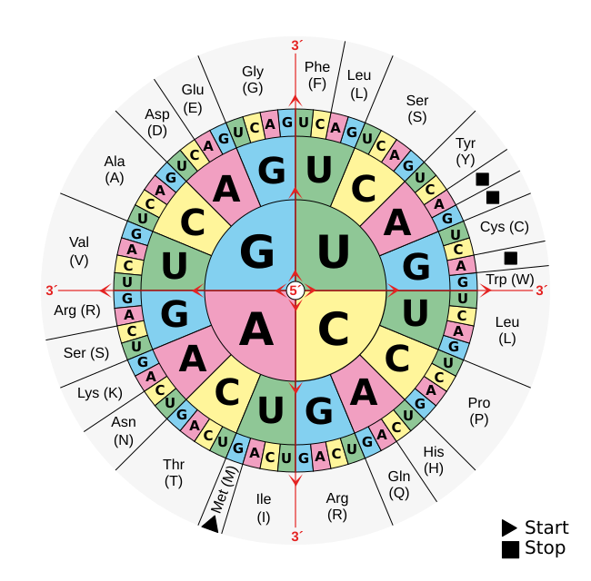

# Proteinbiosynthese

## 1. Transcription im Zellkern
* Replikation eines Teils der Erbinformationen
* Helicase-Enzyme entwinden DNA, blasenartige Öffnung entsteht
    * einer der beiden Einzelstränge, an dem die mRNA später entsteht, nennt sich **codogener Strang** 
* RNA-Polymerasen lagern sich an DNA-Stränge an, "holen" sich im Karyoplasma rumschwimmende komplementäre Nukleotide ran und lagert sie an die *Matrize* an
    → Prä-mRNA-Strang entsteht
* weitere Helicase-Enzyme winden den DNA-Strang hinten wieder auf
* Problem: nicht für alle Merkmale sind Erbinformationen an einer Stelle in DNA gespeichert, bei vielen sind sie über den Strang verteilt
    → fertig synthetisierter Prä-mRNA-Strang enthält unnötige, redundante Abschnitte (die heißen *Introm*) zwischen den benötigten Abschnitten (den *Exons*)
* Prä-mRNA-Strang wird *Cap* auf der einen Seite, *Poly-A-Schwanz* auf der anderen Seite aufgesetzt
    * Schützt vor Kollisionen bzw. Zerstörung bei Schwimmen durch Zellplasma (Cap) und vorzeitigem Auflösen der Erbinformationen (Poly-A-Schwanz)
* *Spleißen* der mRNA erfolgt
    * Introms werden zu schleifenartigen Gebilden zusammengefaltet, dann abgeschnitten
    
    ⇒ fertiger mRNA-Strang entsteht (immer noch mit Cap und Poly-A-Schwanz)

## 2. Translation
* findet in Ribosomen statt
    * zusammengebaut aus einer kleinen Untereinheit ($40 \text{ s}$) und einer großen Untereinheit ($60 \text{ s}$)
* mRNA lagert sich zuerst an kleiner Untereinheit an, große Untereinheit lagert sich danach auch an
    * danach spricht man von einem *aktiviertem* Ribosom
    * das passiert hundert- bis tausendfach an verschiedenen Stellen der mRNA
* tRNA synthetisiert Protein
    
    * hat eine Kleeblattstruktur (wird aber von Herr Schädlich oft mit Symbol ähnlich zu einer 7 dargestellt)
    * Anticodon besteht aus Triplett an Nukleotidbasen (lagert sich dann an mRNA-Strang in Ribosom an, falls es passt), am anderen Ende ist die jeweilige Aminosäure, die durch das Triplett encodiert ist
* Vorgang in Ribosom ist in drei Phasen aufgeteilt:
    1. Initiation
        * tRNA lagert sich an erstes Triplett/Codon (sind so ziemlich Synonyme) der mRNA an
        * danach bewegt sich entweder das Ribosom oder die mRNA um drei Basenpaare weiter (was sich bewegt hängt davon ab, ob das Ribosom frei beweglich oder am endoplasmatischem Retikulum angelagert ist)
    2. Elongation
        * Aminosäuren an jetziger tRNA binden sich an Aminosäure einer neuen tRNA, die sich in erster Phase gleichzeitig wieder im Ribosom anlagert, und bilden eine Peptidbindung
            → Aminosäurekette fängt an sich zu bilden
    3. Termination
        * tRNA, die jetzt keine Aminosäure mehr trägt, lagert sich wieder ab und "holt" sich eine neue Aminosäure, um sich später wieder an eine mRNA anlagern zu können
* Vorgang läuft immer weiter so ab, bis ein Stopp-Codon gefunden wird und sich die Peptidkette vollständig ablöst
    * Wichtig: Jede der drei Phasen in einem Ribosom läuft gleichzeitig ab: Es lagert sich immer eine neue tRNA an, eine weitere "überträgt" gleichzeitig ihre Aminosäurekette an diese neue tRNA und eine dritte lagert sich zeitgleich wieder ab

> Tipp von Herr Schädlich:
> In der Klausur kommt bestimmt eine DNA, aus der man noch die mRNA bilden (komplementäre Basen und U statt T halt) und dann erst mit der Codesonne (siehe Lernsax) das in eine Peptidkette übersetzen muss (und herausfinden welche degeneriert sind).
> 
> Zweiter Tipp:
> Es kann sein, dass diese DNA nicht mit dem Start-Codon (Methionin, AUG in mRNA) beginnt. Alles davor sollte man dann ignorieren, weil die Synthese erst mit dem Start-Codon losgeht.

## Eigenschaften des genetischen Codes
1. er ist fast universell
    (einzige bis heute bekannte Ausnahme: Ciliaten haben andere Start- und Stopp-Codons)
2. alle Aminosäuren sind jeweils in Tripletts (Codons) encodiert
3. der Code ist degeneriert (d.h. redundant)
    * viele Aminosäuren werden durch mehrere Codons bestimmt
4. der Code ist kommafrei
    * Codons schließen lückenlos aneinander
5. der Code ist nicht überlappend
    * eine Base ist immer nur Bestandteil *eines* Codons
6. der Code wird in $5'\to3'$-Richtung gelesen