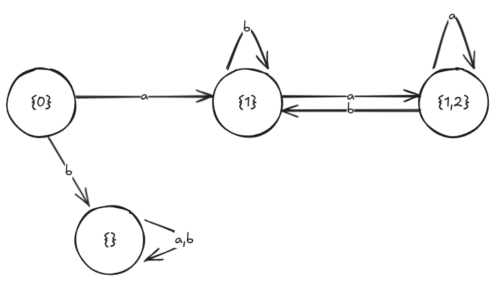

# Automaten

Ein endlicher Automat $A = (Q, I, \Sigma, F, \delta)$ ist eine Verarbeitungseinheit, welche sich stets in einem Zustand befindet und bei Eingabe eines Symboles des Eingabealphabets seinen Zustand wechseln kann.

Er besteht aus:
* einer **endlichen Menge an Zuständen $Q$**,
* einem **Eingabealphabet $\Sigma$**,
* einer **Menge an gültigen Übergängen $\delta$**,
* einer **Menge an initialen Zuständen $I$** und
* einer **Menge an finalen Zuständen $F$**.

Übergänge bestehen hierbei aus dem Ausgangszustand, dem Element des Eingabealphabets und dem resultierenden Zustand: $\exists(q_1, a, q_2) \in \delta\,,~a\in\Sigma,~q_1,\,q_2\in Q$

> #### Beispiel:
> 
> 
> km = kleiner Mario \
> gm = großer Mario \
> fm = Feuer-Mario \
> tm = toter Mario \
> Sieg = Siegeskondition
> 
> p = Pilz \
> b = Blume \
> s = Panzer \
> f = Fahne
> 
> $$
> \begin{align*}
> Q &= \set{\text{tm}; \text{km}; \text{gm}; \text{fm}; \text{Sieg}} \\
> \Sigma &= \set{p; b; f; s} \\
> \delta &= \{(\text{km}, p, \text{gm}); (\text{gm}, p, \text{gm}); (\text{km}, b, \text{fm}); (\text{gm}, b, \text{fm}); (\text{fm}, p, \text{fm}); (\text{fm}, b, \text{fm});\\
&~~~~~~~\,(\text{fm}, s, \text{gm}); (\text{gm}, s, \text{km}); (\text{km}, s, \text{tm}); (\text{km}, f, \text{Sieg}); (\text{gm}, f, \text{Sieg});\\
&~~~~~~~\,(\text{fm}, f, \text{Sieg})\} \\
> I &= \set{\text{km}} \\
> F &= \set{\text{Sieg}} \\
> A &= (Q, I, \Sigma, F, \delta)
> \end{align*}
> $$

### Akzeptierender Lauf
Ein akzeptierender Lauf eines Automaten $A$ ist eine Abfolge an Übergängen mit Eingabesymbolen, wobei der Lauf in einem initialen Zustand beginnt und in einem Finalzustand endet. Zu jedem akzeptierenden Lauf gehört ein Eingabewort bestehend aus Symbolen des Eingabealphabets.

### Sprache des Automaten
Die Sprache $\mathcal L$ eines Automaten $A$ ist die Menge aller Wörter über dem Eingabealphabet, die vom Automaten akzeptiert werden, das heißt, dass sie einen akzeptierenden Lauf innerhalb von $A$ haben.

Diese Sprache wird mit $\mathcal L(A)$ bezeichnet.

> Beispiel aus dem vorherigen Beispiel: \
> $\displaystyle (p, p, f) \in \mathcal L(A) $ \
> $\displaystyle (p, b, p, s, s, f) \in \mathcal L(A) $ \
> $\displaystyle (p, b, p, s, s, s) \notin \mathcal L(A) $

#### Übung
Estellt einen "Automaten", der E-Mail-Adressen erkennt. Also die Sprache des Automaten alle E-Mail-Adressen sind.

$$
\begin{align*}
\Sigma &= \left\{ \text a; \text b; \text c; \dots; \text x; \text y;\text z; \text A; \text B; \text C; \dots; \text X; \text Y;\text Z; 0; 1; 2; \dots; 7; 8; 9; ,; -; \_; .; @ \right\}
\end{align*}
$$

### Potenzmengenkonstruktion

$~$|$a$|$b$
-|-|-
$\set{0}$|$\set{1}$|$\emptyset$
$\set{1}$|$\set{1,2}$|$\set{1}$
$\set{2}$|$\emptyset$|$\emptyset$
$\set{1,2}$|$\set{1,2}$|$\set{1}$
$\emptyset$|$\emptyset$|$\emptyset$