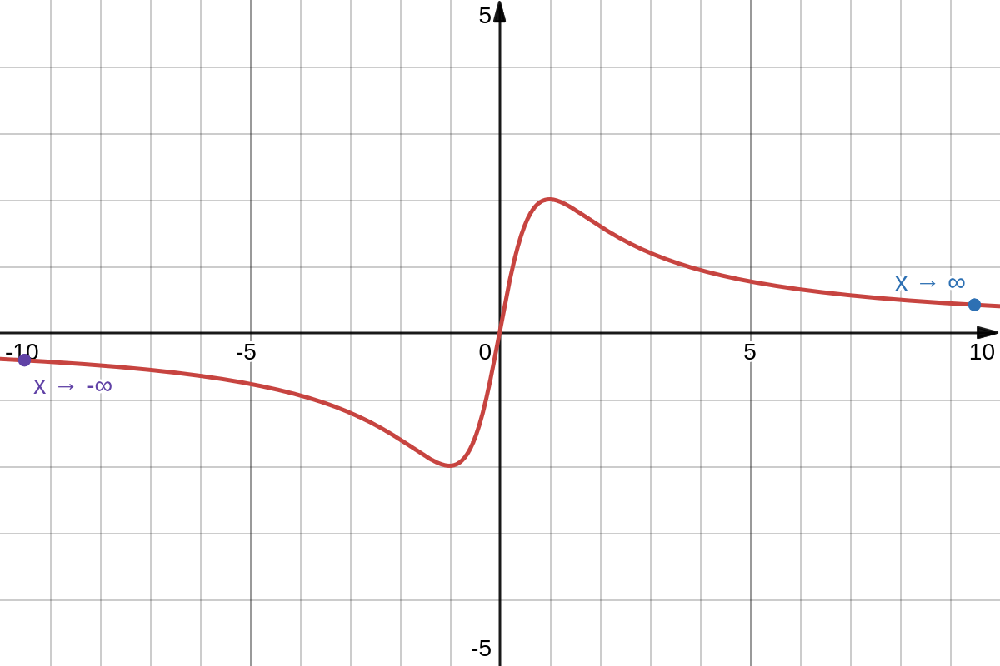
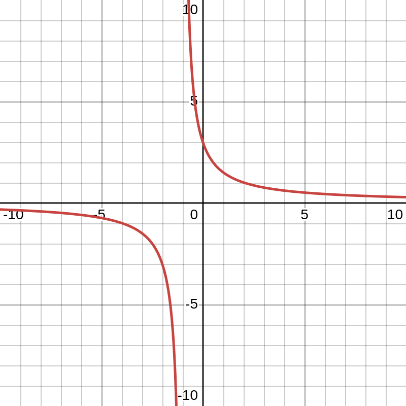
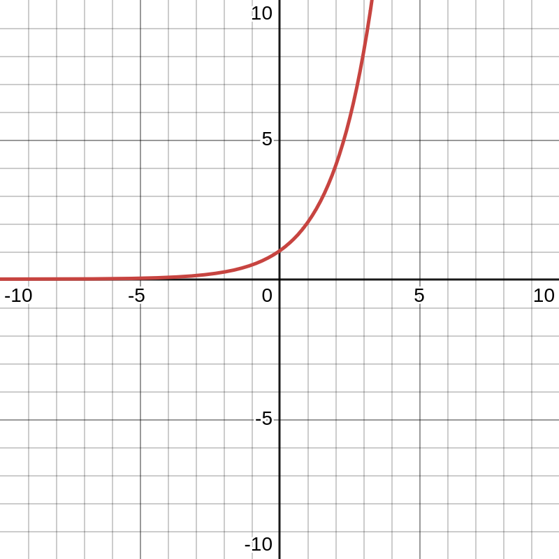
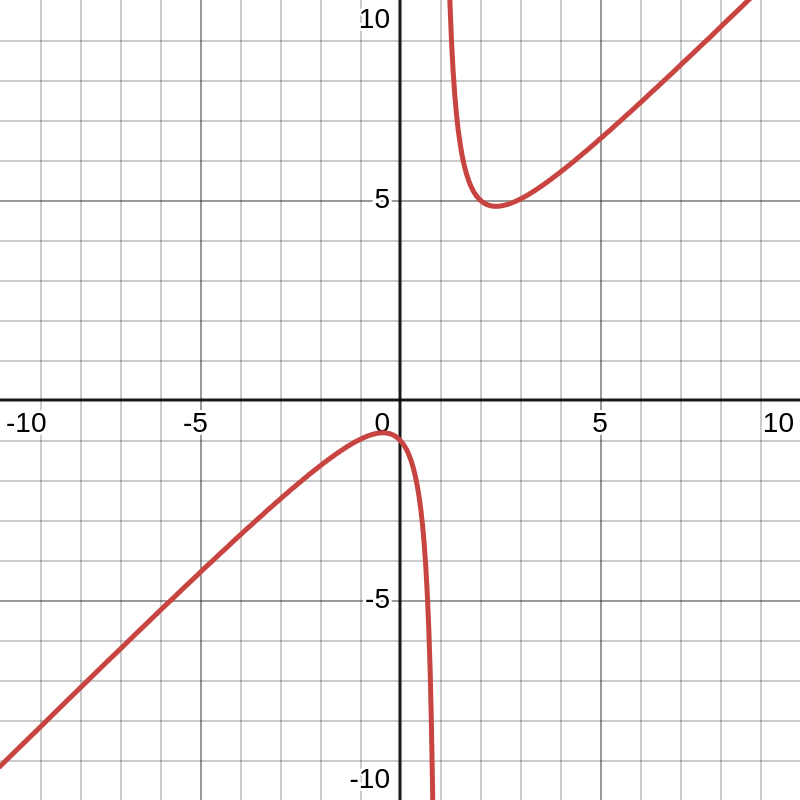
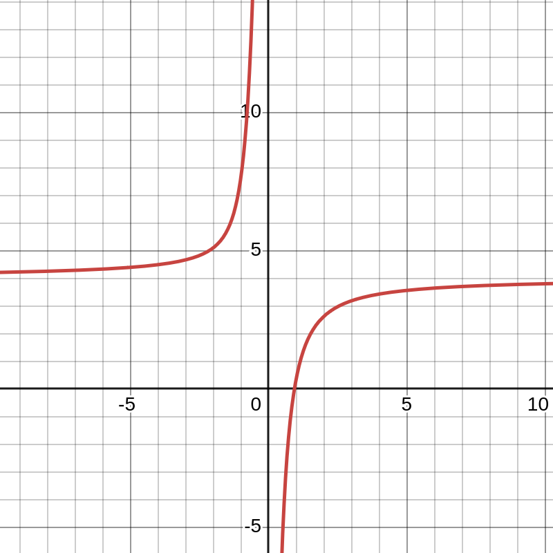

```latex {cmd=true hide latex_zoom=5}
\documentclass[varwidth]{standalone}
\usepackage{xcolor}
\color{white}
\begin{document}
Differentialrechnung
\\
\end{document}
```
---

# 2. Grenzwerte von Funktionen

## 2.1. Verhalten von Funktionen im Unendlichen

$f(x) = \frac{4x}{x^2+1}$:



"$x$ strebt gegen Unendlich" bzw. "$x$ strebt gegen Minus Unendlich"

## $~$
> #### Der Grenzwert
> Der **Grenzwert** einer Funktion (auch **Limes** genannt) bezeichnet denjenigen Wert, dem sich die Funktion im Unendlichen annähert.
> 
> Man schreibt: $$\lim_{x\rightarrow\infty} \frac{4x}{x^2+1} = 0$$
> $$\lim_{x\rightarrow\infty} x^2 + 1 = \infty\\~$$
> 
> Existiert ein *Grenzwert* (also ergibt der Limes eine konkrete Zahl und keine Unendlichkeit), dann **konvergiert** die Funktion. Andernfalls **divergiert** sie.
##### $~$

### Beispiel
$$
\begin{array}{lllr}
\displaystyle\lim_{x\to\infty}   & -x^2 &=& -\infty \\
\displaystyle\lim_{x\to -\infty} & 2x^2 &=& \infty \\
\displaystyle\lim_{x\to \infty}  & \frac1x &=& 0 \\
\displaystyle\lim_{x\to \infty}  &(\frac1{x^2} + 2) &=& 2 \\
\displaystyle\lim_{x\to -\infty} &(-x^3) &=& \infty
\end{array}
$$

### Aufgabe
#### 1. Untersuchen Sie das Verhalten der Funktion $$f(x) = \frac{2x^2 + 4x}{x^2+1}$$ für $$x\to\infty$$ mithilfe einer Wertetabelle

$x$|$f(x)$
-|-
$ 1       $|$ 3 $
$ 100     $|$ \approx 2,03980 $
$ 1000    $|$ \approx 2,00400 $
$ 100.000 $|$ \approx 2,00004 $
$ 10^{20} $|$ \approx 2,00000 $

$\displaystyle\Rightarrow \lim_{ x\to\infty }{ \frac{2x^2 + 4x}{x^2+1} } = 2$

### $~$
#### 2. Bestimmen Sie $\displaystyle \lim_{ x\to-\infty }{ \frac{2x^2+4x}{x^2+1} }$ mithilfe einer Wertetabelle.

$x$|$f(x)$
-|-
$ -1       $|$ -1 $
$ -100     $|$ \approx 1,96 $
$ -1000    $|$ \approx 1,996 $
$ -100.000 $|$ \approx 1,99996 $
$ -10^{20} $|$ \approx 1,99999999999999999996 $

$\displaystyle\Rightarrow \lim_{ x\to-\infty }{ \frac{2x^2 + 4x}{x^2+1} } = 2$

#### 3. Bestimmen Sie den Grenzwert ohne Wertetabelle, indem Sie für $x$ sehr große Werte einsetzen. Überprüfen Sie ihre Lösung mit dem CAS und zeichnen Sie den Graphen.

##### a.
$
\displaystyle
\lim_{x\to\infty}{\frac3{x+1}} = 0^+
\\~\\
\lim_{x\to-\infty}{\frac3{x+1}} = 0^-
$


##### b.
$
\displaystyle
\lim_{x\to\infty}{2^x} = \infty
\\~\\
\lim_{x\to-\infty}{2^x} = 0
$


##### c.
$
\displaystyle
\lim_{x\to\infty}{\frac{x^2+1}{x-1}} = \infty
\\~\\
\lim_{x\to-\infty}{\frac{x^2+1}{x-1}} = -\infty
$


##### d.
$
\displaystyle
\lim_{x\to\infty}{\frac{8x^3 - 7}{2x^3 + x^2 + x}} = 4
\\~\\
\lim_{x\to-\infty}{\frac{8x^3 - 7}{2x^3 + x^2 + x}} = 4
$


## 2.2. Waagerechte und schiefe Asymptoten gebrochenrationaler Funktionen

> #### $\\$Definition *Gebrochenrationale Funktion*
> Eine Funktion deren Funktionsterm als Quotient $\frac{p(x)}{q(x)}$ von zwei ganzrationalen Funktionen $p(x)$ und $q(x)$ mit $q(x) \neq 0$ geschriebne werden kann.
> $~$

### Aufgabe
Ordnen Sie die Graphen nach der Lage ihrer waagerechten Symptoten:
* auf der $x$-Achse
* parallel zur $x-Achse$
* keine bzw. schiefe Asymptote

Untersuchen Sie, wie man anhand des Funktionsterms entscheiden kann, ob der Graph eine waagerechte Asymptote besitzt und wie deren Gleichung lautet.

---

Angenommen, in einer Funktion der Form $f(x)=\displaystyle\frac{p(x)}{q(x)}$ sind die Grade der Funktionen definiert als $m$ für $p(x)$ und $n$ für $q(x)$, dann gilt:

Wenn $m<n$, dann ist die Asymptote definiert als $y=0$,

wenn $m=n$, dann ist die Asymptote definiert als $y=a$, wobei $a$ die Division der beiden Leitkoeffizienten von $p$ und $q$ ist,

wenn $m=n+1$, dann ist die Asymptote definiert als das Ergebnis der Polynomdivision $p(x) : q(x)$ (ohne Rest),

wenn $m>n+1$, dann existiert keine schräge oder zur x-Achse parallele Asymptote.

## 2.3. Der Grenzwert an einer Stelle und senkrechte Asymptoten

$\displaystyle
a(x) = \frac{1}{x-4}\\
D: x\in\mathbb R; x\neq 4 \\
\text{Asymptote: }x = 4
$

$\displaystyle
b(x) = \frac{x-8}{x-4} \\
D: x\in\mathbb R; x\neq 4 \\
\text{Asymptote: }x=4
$

$\displaystyle
c(x) = \frac{x^3-60}{x-4} \\
D: x\in\mathbb R; x\neq 4 \\
\text{Asymptote: }x=4
$

$\displaystyle
d(x) = \frac{2x-8}{x-4} \\
D: x\in\mathbb R; x\neq 4 \\
\text{Asymptote: }\bold{keine}
$

$\displaystyle
e(x) = \frac{x^2-16}{x-4} \\
D: x\in\mathbb R; x\neq 4 \\
\text{Asymptote: }\bold{keine}
$

Die Graphen der Funktionen $a$, $b$ und $c$ besitzen an der Stelle $x=4$ eine senkrechte Asymptote - diese Stelle nennt man *Polstelle*.
Die Graphen der Funktionen $d$ und $e$ besitzen an der Stelle $x=4$ **keine** Asymptote, sondern eine *hebbare Definitionslücke*.

Bsp.: Untersuchen Sie das Verhaltne der funktion $\displaystyle f(x) = \frac{6x-1}{x-2} $ an der Stelle $x=2$. Skizzieren Sie den Graphen von $f$

linksseitiger Grenzwert:
$x$|$f(x)$
-|-
$ 1,9     $|$ -104 $
$ 1,999   $|$ -10.994 $
$ 1,99999 $|$ -1.099.994 $
$ \downarrow $|$ \downarrow $
$ 2 $|$ -\infty $

$\displaystyle \underset{x<2}{\lim_{x\to2}} \frac{6x-1}{x-2} = -\infty $

rechtsseitiger Grenzwert:
$x$|$f(x)$
-|-
$ 2,1     $|$ 116 $
$ 2,001   $|$ 11.006 $
$ 2,00001 $|$ 1.100.006 $
$ \downarrow $|$ \downarrow $
$ 2 $|$ \infty $

$\displaystyle \underset{x>2}{\lim_{x\to2}} \frac{6x-1}{x-2} = \infty $

Asymptoten: $y=6; x=2$

> Wenn bei der Polynomdivision kein Rest entsteht, dann existiert keine senkrechte Asymptote, sondern eine Definitionslücke, sonst existiert mindestens eine Asymptote.

Eine Stelle $x_0$, an der für $x\to x_0$ gilt, dass $f(x)\to\infty$ bzw. $f(x)\to-\infty$, heißt *Polstelle* von $f$. $f$ besitzt dann die senkrechte Asymptote mit der Gleichung $x=x_0$.

### Übung

$\displaystyle f(x) = \frac{9-x^2}{x-3} $

$\displaystyle (9-x^2) : (x-3) = -x - 3 \text{ R } 0 $

$\displaystyle \underset{x<3}{\lim_{x\to3}} \frac{9-x^2}{x-3} = -6 $
$\displaystyle \underset{x>3}{\lim_{x\to3}} \frac{9-x^2}{x-3} = -6 $
$\displaystyle \rightarrow \lim_{x\to3} \frac{9-x^2}{x-3} = -6 $

Es gibt keine Asymptote, sondern nur eine hebbare Definitionslücke an der Stelle $x=3$.

> Existieren der linksseitige und der rechtsseitige Grenzwert und sind beide Grenzwerte gleich, dann besitzt die untersuchte Funktion an der Stelle $x_0$ einen Grenzwert.
> 
> D.h.
> $$
> \begin{align*}
> \underset{x<3}{\lim_{x\to3}} f(x) &= a \\
> \underset{x>3}{\lim_{x\to3}} f(x) &= a \\
> \lim_{x\to3} f(x) &= a \\
> \end{align*}
> $$

## 2.4. Stetigkeit

Funktion|Stelle $x_0$ |$f(x_0)$|$\displaystyle \lim_{x\to x_0} f(x)$|Stetig an $x_0$?
-|-|-|-|-
$ f(x)=x^2 $|$ x_0=2 $|$ 4 $|$ 4 $|Ja
$ f(x)=\frac1{x^2} $|$ x_0=0 $|$ \text{n.D.} $|$ \infty $|Nein
$ f(x)=\frac{x^2-4}{x-2} $|$ x_0=2 $|$ \text{n.D.} $|$ 4 $|Nein
$ f(x)=\begin{cases}2,x<1\\5,x\ge1\end{cases} $|$ x_0=1 $|$ 5 $|$ 2, x<1\\5, x>1 $|Nein
$ f(x)=\begin{cases}\frac{x^2-4}{x-2}, x\neq2\\1,x=2\end{cases} $|$ x_0=2 $|$ 1 $|$ 4 $|Nein
$ f(x)=\begin{cases}\frac{x^2-4}{x-2}, x\neq2\\4,x=2\end{cases} $|$ x_0=2 $|$ 4 $|$ 4 $|Ja

### Geltende Bedingungen für die Stetigkeit

Die Funktion $f(x)$ ist an einer Stelle $x_0$ stetig, wenn $f(x_0)$ definiert ist, $\displaystyle \lim_{x\to x_0}f(x)$ existiert und beide Werte Übereinstimmen. In einem Intervall $I$ ist eine Funktion $f(x)$ stetig, wenn alle Stellen $x_0 \in I$ für die Funktion $f(x)$ stetig sind.