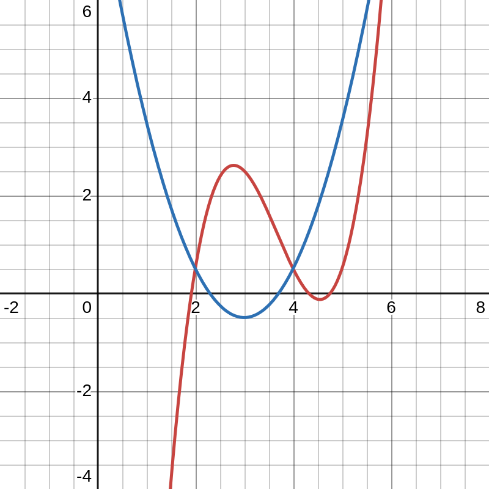

Gegeben sind die Funktionen $f$ und $g$ mit $\displaystyle f(x) = x^3-11x^2+38x-39,5 $ und $\displaystyle g(x) = x^2 - 6x + 8,5 $.

**a.** Zeichnen Sie die Graphen von $f$ und $g$ in ein geeignetes Koordinatensystem.

**b.** Berechnen Sie die Differenz der Funktionswerte von $f$ und $g$ an der Stelle $x=2,5$.

$$
\begin{align*}
f(2,5) = 2,375 \\
g(2,5) = -0,25 \\
f(2,5) - g(2,5) = 2,625
\end{align*}
$$

**c.** Untersuchen Sie, an welcher Stelle $u$ ($u\in\mathbb R; 2\leq u\leq4$) die Differenz der Funktionswerte von $f$ und $g$ maximal ist und berechnen Sie die maximale Differenz.

$$
\begin{align*}
z(u) &= f(u)-g(u) \\
&= u^3 - 12u^2 + 44u - 48 \\
z'(u) &= 3u^2 - 24u + 44 \\
z''(u) &= 6u - 24
\end{align*}
$$

$$
\begin{align*}
z'(u) &\overset!= 0 \\
\rightarrow u &= 4 \pm \frac{2\sqrt3}{3} \\
z''(4 + \frac{2\sqrt3}{3}) &= 4\sqrt3 \rightarrow \text{TP} \\
z''(4 - \frac{2\sqrt3}{3}) &= -4\sqrt3 \rightarrow \text{HP}
\end{align*}
$$

$$
\begin{align*}
z(4 - \frac{2\sqrt3}{3}) = \frac{16\sqrt3}{9}
\end{align*}
$$

---

Untersuchen Sie, wo der Unterschied zwischen den Potenzen $a^2$ und $a^3$ für $0<a<1$ am größten ist. Geben Sie den exakten Unterschied an.

$$
\begin{align*}
z(u) &= u^2-u^3 \\
z'(u) &= 2u-3u^2 \\
z'(u) &\overset!= 0 \\
\rightarrow u &= \frac{1\pm1}{3} &u=0~&\text{entfällt} \\
\Rightarrow u &= \frac23 \\
z\left(\frac23\right) &= \frac49 - \frac8{27} \\
&= \frac4{27}
\end{align*}
$$

---

$\displaystyle f_a(x) = ax^3 - 3ax^2 + 3ax - a - 1 ~~~ a \neq 0 $
$\displaystyle g(x) = -x $

$$
\begin{align*}
f'_a(x) &= 3ax^2 - 6ax + 3a \\
f''_a(x) &= 6ax - 6a \\
f'''_a(x) &= 6a
\end{align*}
$$

$$
\begin{align*}
f''_a(x_w) &\overset!= 0 \\
\rightarrow x_w &= 1
\end{align*}
$$

$$
\begin{align*}
f'_a(1) &= m_1 = 0 \\
g'(1) &= m_2 = -1 \\
\Delta m &= 1 \\
\arctan \Delta m &= 45\degree
\end{align*}
$$