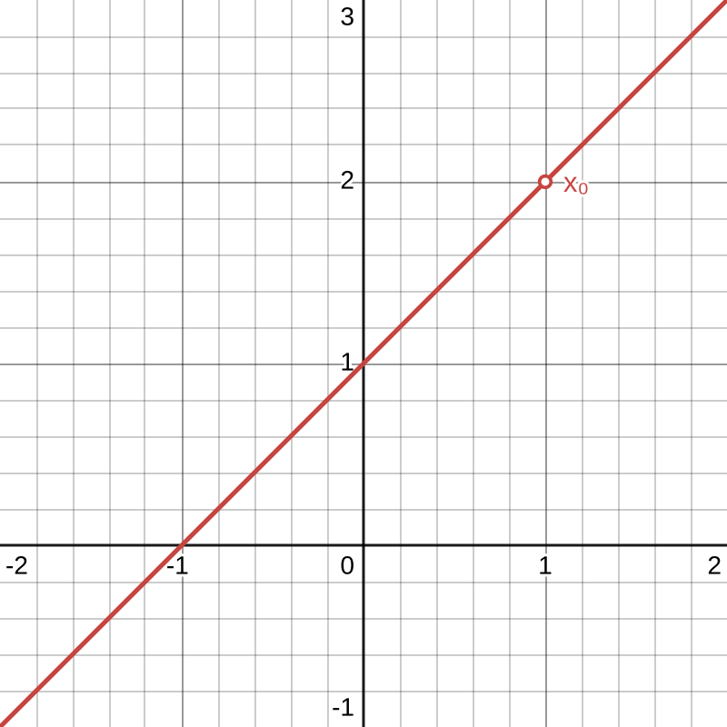
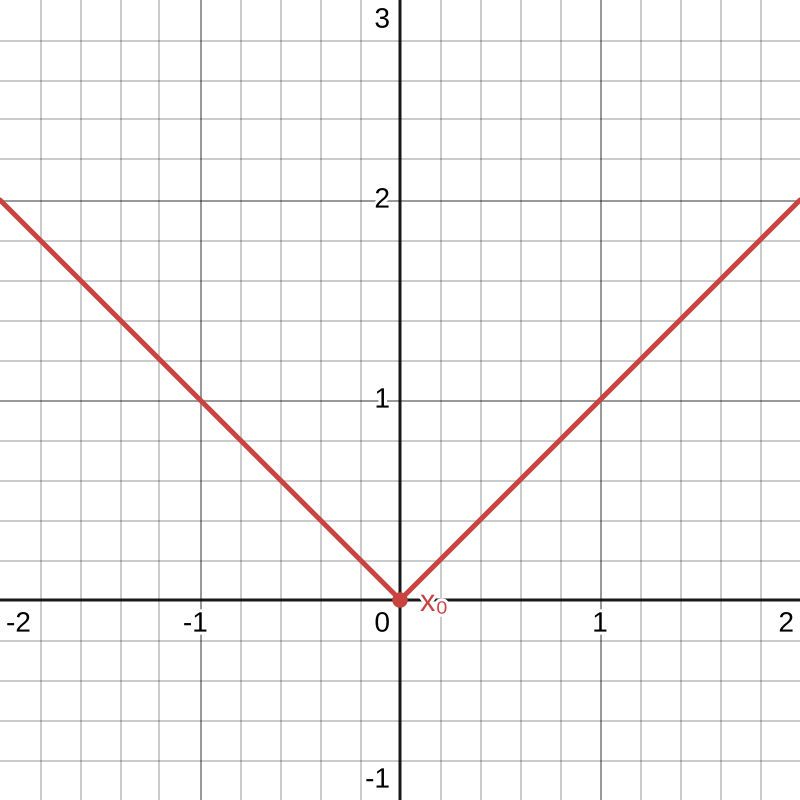
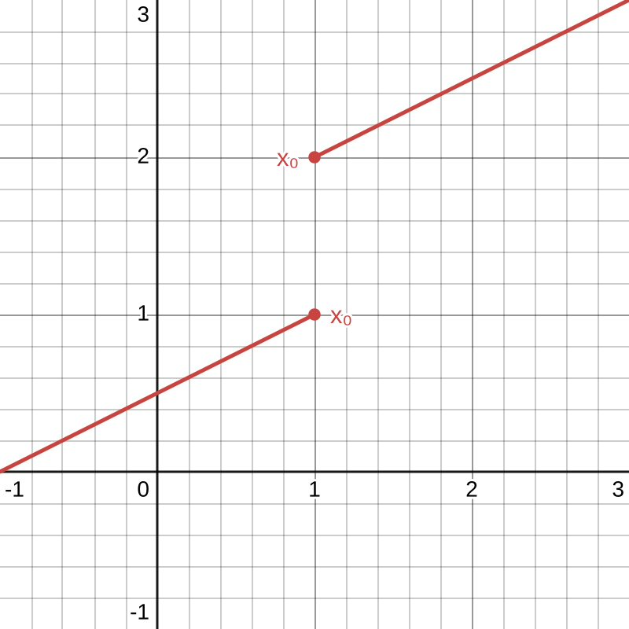
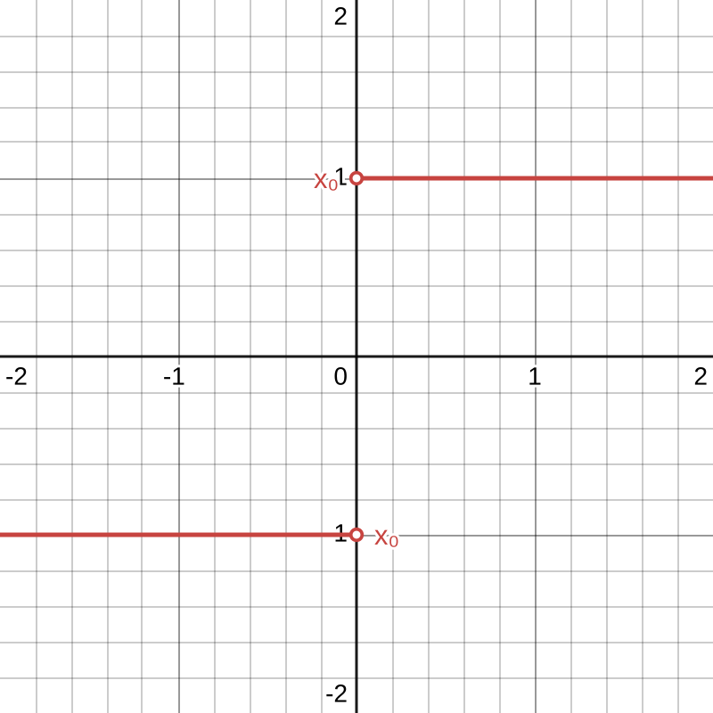
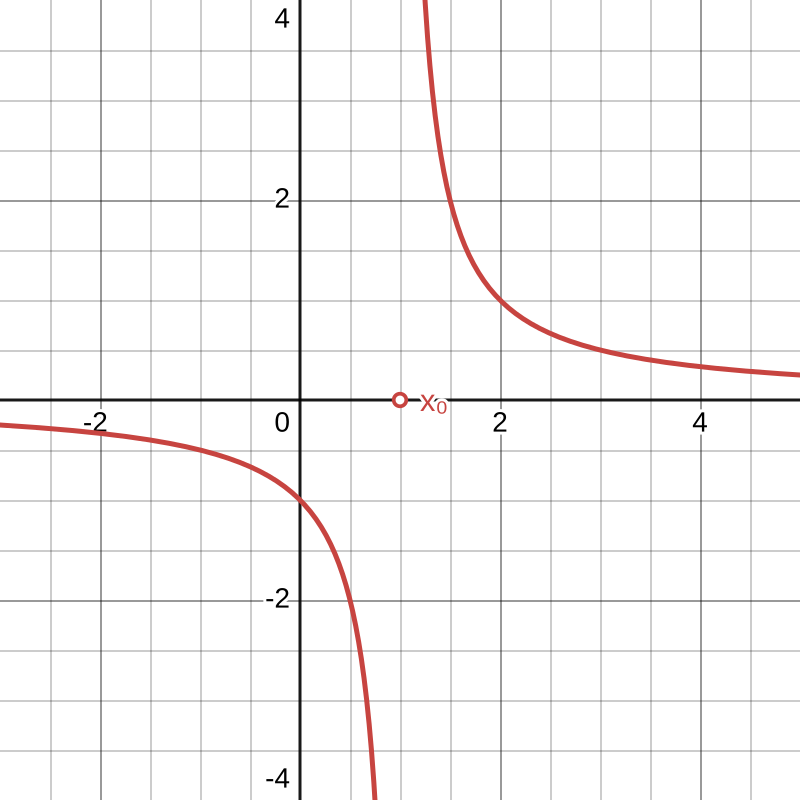

$\displaystyle f_1(x) = \frac{x^2-1}{x-1} $

#### $~$
$\displaystyle f_2(x) = |x| $

#### $~$
$\displaystyle f_3(x) = \begin{cases}
\frac12x+1, x<1 \\
\frac12x+2, x\ge1
\end{cases} $

#### $~$
$\displaystyle f_4(x) = \frac{|x|}{x} $

#### $~$
$\displaystyle f_5(f) = \frac1{x-1} $

Eigenschaften|$f_1$|$f_2$|$f_3$|$f_4$|$f_5$
-|-|-|-|-|-
Definitionsbereich|$\mathbb R \setminus \{1\}$|$\mathbb R$|$\mathbb R$|$\mathbb R\setminus\{0\}$|$\mathbb R\setminus\{1\}$
$\displaystyle \lim_{x\to x_0} f_n(x) $|$2$|$0$|$1^-,~ 2^+$|$-1^-,~1^+$|$\pm\infty^\pm$
$\displaystyle f_n(x_0) $|$\text{n.d.}$|$0$|$2$|$\text{n.d.}$|$\text{n.d.}$
Stetigkeit an der Stelle $x_0$|nicht Stetig|stetig|nicht stetig|nicht stetig|nicht stetig
Ggf. Art der Unstetigkeit|hebbare Definitionslücke|-|Sprungstelle|h.D.|Polstelle