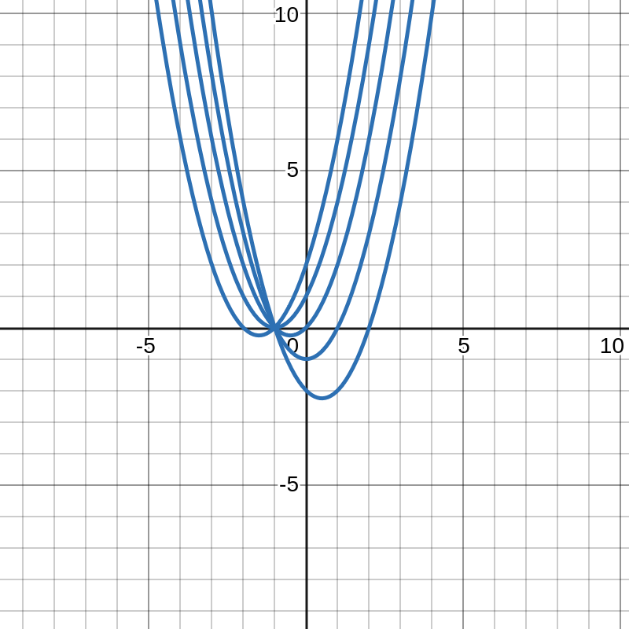
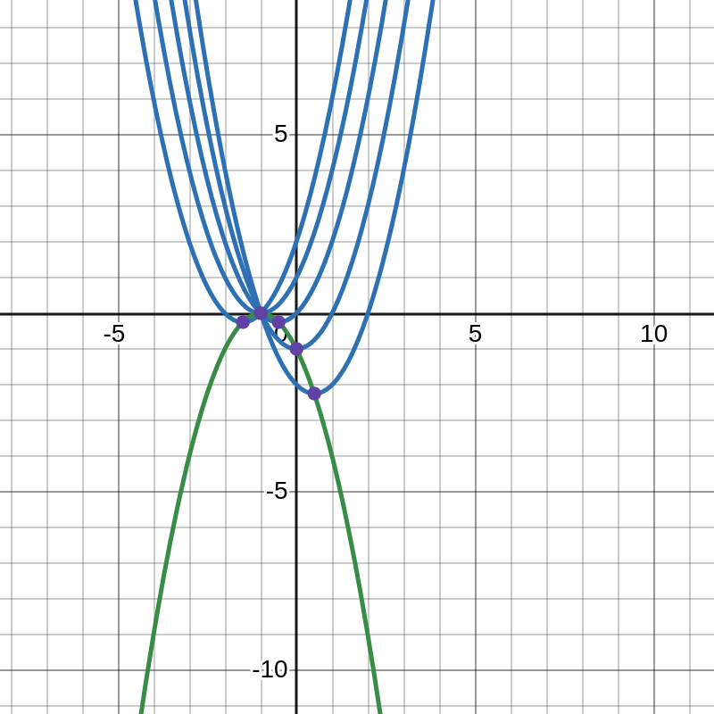

$$
\begin{align*}
f_t(x) &:= x^2 + (t+1)x + t &t\in\mathbb R
\end{align*}
$$

Gemeinsamkeiten|Unterschiede
-|-
Parabeln nach oben geöffnet|Scheitelpunkt
eine Nullstelle bei $x_N = -1$|Anstieg an jeder Stelle $x$
$~$|

$$
\begin{align*}
f_t(x_N) &= 0 \\
\rightarrow x_N^2 + (t+1)x_N + t &= 0\\
\Rightarrow x_N &= - \frac{t+1}{2} \pm \sqrt{ \frac{(t-1)^2}{4} } \\
&= \frac{-t-1\pm(t-1)}{2} \\
&\in\left\{ -1; -t \right\}
\end{align*}
$$

### $~$

$$
\begin{align*}
f_t(x) &:= x^2 + (t+1)x + t \\
f'_t(x) &= 2x + t + 1
\end{align*}
$$

$$
\begin{align*}
f'_t(x) &= 0 \\
\rightarrow 2x + t + 1 &= 0 \\
\rightarrow x &= -\frac{t+1}{2}
\\~\\
f_t( \frac{-t-1}{2} ) &= \left( \frac{-t-1}{2} \right)^2 + (t+1)\cdot\frac{-t-1}{2} + t \\
&= -\frac{ (t-1)^2 }{4}
\end{align*}
$$

$\displaystyle \Rightarrow T\left( -\frac{t+1}{2}\right|\left. -\frac{(t-1)^2}{4} \right) $

#### $~$

$$
\begin{align*}
x(t) &= -\frac{t+1}{2} \\
y(t) &= -\frac{(t-1)^2}{4} \\
~\\
\rightarrow t(x) &= -2x-1 \\
\Rightarrow y(x) &= -\frac{((-2x-1)-1)^2}{4} \\
&= -\frac{ (-2x-2)^2 }{4} \\
&= -(x+1)^2 \\
&= -x^2 - 2x - 1
\end{align*}
$$

Sowohl die x- als auch die y-Koordinate sind abhängig von der selben Variablen t. Wenn also eine der beiden Funktionsgleichungen $x(t)$ oder $y(t)$ nach $t$ umgestellt werden, erhält man eine $t(x)$- bzw. $t(y)$-Funktion. Ich habe also $x(t)$ nach $t(x)$ umgestellt. Danach habe ich die $t(x)$-Funktion in $y(t)$ eingesetzt, um $y(t(x))$ zu berechnen und so $t$ zu eliminieren, um die Funktion $y(x)$ zu erhalten.