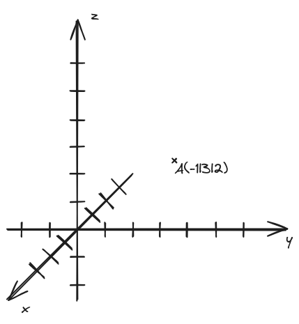
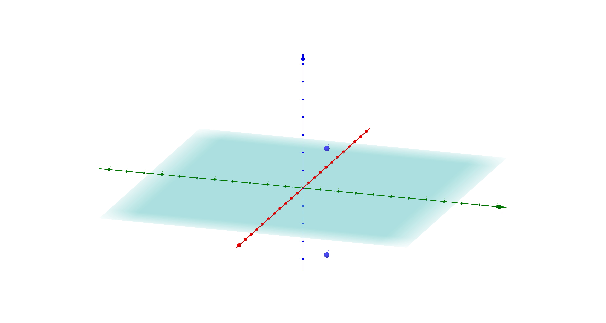

```latex {cmd=true hide latex_zoom=5}
\documentclass[varwidth]{standalone}
\usepackage{xcolor}
\color{white}
\begin{document}
Vektoren, Geraden und\\
Ebenen
\\
\end{document}
```
---

# 1. Lage von Punkten im Raum
###### 3 Dimensionen, yippie!

## Kartesisches Koordinatensystem und Lage von Punkten



Sind jeweils zwei Achsen zueinander *senkrecht*, so spricht man von einem **kartesischen Koordinatensystem**.
Für die x-Achse gilt in der Regel: Eine Längeneinheit enstpricht der halben Anzahl an Kästchen der Längeneinheiten anderer Achsen in Kästchendiagonalen (also wenn 1 LE = 2 Kästchen bei y- und z-Achse, dann 1 LE = 1 Kästchendiagonale bei x-Achse).

Punkte werden in der Form $\displaystyle P(x|y|z) $ angegeben.
Die Koordinatenachsen werden häufig auch mit $x_1$, $x_2$ und $x_3$ bezeichnet (weil IQB denkt, dass das besser wäre oder so, ist es aber nicht).

## Die drei Koordinatenebenen


**Definitionen der Ebenen**
$
\begin{matrix}
\text{x-z-Ebene}:&y=0 \\
\text{x-y-Ebene}:&z=0 \\
\text{y-z-Ebene}:&x=0 \\
\end{matrix}
$

## Die acht Oktanten


(Wie die Quadranten im 2D-Koordinatensystem, aber halt für ein 3D-Koordinatensystem)

## Spiegelung von Punkten an den Koordinatenebenen

**Aufgabe: Der Punkt $\displaystyle P(2|2|3) $ wird an der $xy$-Ebene gespiegelt**

(der obere Punkt ist $P$, der untere der gespiegelte Punkt $P'$)
$\displaystyle P'(2|2|-3) $