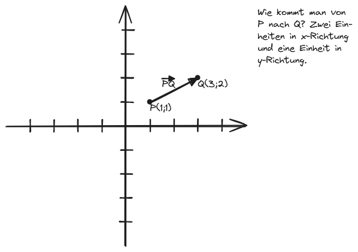

```latex {cmd=true hide latex_zoom=5}
\documentclass[varwidth]{standalone}
\usepackage{xcolor}
\color{white}
\begin{document}
Vektoren, Geraden und\\
Ebenen
\\
\end{document}
```
---

# 2. Vektoren im Koordinatensystem
###### Yippie!!!!!! :DDDD

## 2.1. Defintion des Vektors

Mithilfe von Vektoren kann man Verschiebungen von Punkten beschreiben.


Vektor: $\displaystyle \overrightarrow{PQ} = \left(\begin{array}{c}2\newline 1\end{array}\right) $ (beschreibt, *wie man von $P$ nach $Q$ kommt*)
**Wichtig:** Der Vektor ist *die Klasse aller Pfeile*, die in genau die selbe Richtung zeigen und genau gleich lang sind! Wenn man also zwei weitere Punkte $R$ und $S$ hätte, die auch 2 Einheiten in x- und 1 Einheit in y-Richtung entfernt sind, wäre der Vektor von $R$ zu $S$ auch:
$\displaystyle \overrightarrow{RS} = \left(\begin{array}{c}2\newline 1\end{array}\right) $

Man kann Vektoren auch allgemeinere Namen geben: $\overrightarrow a$ wäre auch statt $\overrightarrow{PQ}$ im obrigen Beispiel möglich gewesen.

#### Definition
```latex {cmd=true hide latex_zoom=2}
\documentclass[varwidth]{standalone}
\usepackage{xcolor}
\color{white}
\begin{document}
Ein \textsl{Vektor} ist die \textbf{Menge} aller parallelen, gleich langen und gleich gerichteten \textbf{Verschiebungen}.
\end{document}
```

## 2.2. Bestimmen eines Vektors mithilfe zweier Punkte


$\displaystyle \overrightarrow{PQ} = \left(\begin{array}{c}q_x - p_x\newline q_y - p_y\end{array}\right) = \left(\begin{array}{c}3-1\newline 2-1\end{array}\right) = \left(\begin{array}{c}2\newline 1\end{array}\right) $ (das gilt für alle Vektoren)

## 2.3. Gegenvektor und Ortsvektor

Sind die Pfeile zweier Vektoren $\displaystyle \overrightarrow a $ und $\displaystyle \overrightarrow b $ parallel, gleich lang und entgegengesetzt gerichtet, so heißt $\displaystyle \overrightarrow a $ **Gegenvektor** zu $\displaystyle \overrightarrow b $ und es gilt: $$\overrightarrow a = -\overrightarrow b $$

Ortsvektoren sind Vektoren, die vom *Koordinatenursprung* ausgehen. Sie geben dadurch nicht nur die Verschiebung vom Punkt $(0|0)$ bzw. $(0|0|0)$, sondern auch die Position eines Punktes an.

Ortsvektoren gehen vom Koordinatenursprung $O(0|0)$ bzw. $O(0|0|0)$ aus, deshalb wird er für jeden Punkt $P$ mit $\overrightarrow{OP}$ bezeichnet und ist definiert als: $\displaystyle \overrightarrow{OP} = \left(\begin{array}{c}p_x-0\newline p_y-0\end{array}\right) = \left(\begin{array}{c}p_x\newline p_y\end{array}\right) $.

## 2.4. Addieren, Subtrahieren und Vervielfachen von Vektoren

Hier würde ein Koordinatensystem mit grafischer Veranschaulichung stehen, aber dafür bin ich zu faul, deswegen hier die Gleichungen, weil das sowieso simpel ist:

$$
\begin{align*}
\left(\begin{array}{c}a_x\newline a_y\newline a_z\end{array}\right) + \left(\begin{array}{c}b_x\newline b_y\newline b_z\end{array}\right) &= \left(\begin{array}{c}a_x+b_x\newline a_y+b_y\newline a_z+b_y\end{array}\right) \\
\left(\begin{array}{c}a_x\newline a_y\newline a_z\end{array}\right) - \left(\begin{array}{c}b_x\newline b_y\newline b_z\end{array}\right) &= \left(\begin{array}{c}a_x-b_x\newline a_y-b_y\newline a_z-b_y\end{array}\right) \\
b \cdot \left(\begin{array}{c}a_x\newline a_y\newline a_z\end{array}\right) &= \left(\begin{array}{c}a_x\cdot b\newline a_y\cdot b\newline a_z\cdot b\end{array}\right)
\end{align*}
$$

Es gibt außerdem einen Nullvektor $\displaystyle \overrightarrow o = \left(\begin{array}{c}0\newline 0\newline 0\end{array}\right) $.

Wenn man Vielfache von Vektoren addiert oder subtrahiert, nennt man das **Linearkombination**.

### Mittelpunkte von Strecken bestimmen

Der Mittelpunkt der Strecke $\displaystyle \overrightarrow{ AB } $ ist $\displaystyle \left(x_A + \frac12 \overrightarrow{ AB }_x ~\middle|~ y_A + \frac12 \overrightarrow{ AB }_y\right) $ bzw. das arithmetische Mittel aller Komponenten.

$\displaystyle (3,5|6|1,5) $, arithmetisches Mittel

### Mittelpunkte von Dreiecken bestimmen

Das arithmetische Mittel der drei Punkte.

## 2.5. Lineare Abhängigkeit und Unabhängigkeit von Vektoren

### Zwei Vektoren

$$
\begin{align*}
\overrightarrow{ a } &= \left(\begin{array}{c}4\newline 0\end{array}\right) \\
\overrightarrow{ b } &= \left(\begin{array}{c}-1\newline 0\end{array}\right) \\
\overrightarrow{ a } &= -4 \overrightarrow{ b }
\end{align*}
$$

Wenn zwei Vektoren Vielfache voneinander sind, sind sie **linear abhängig** (oder auch *kollinear*). Sobald dies nicht gegeben ist, sind die Vektoren *linear unabhängig* voneinander.

### Mehr als zwei Vektoren

Mehrere Vektoren sind linear abhängig, wenn mindestens einer dieser Vektoren als Linearkombination der anderen dargestellt werden kann.

### Beispiel
$$
\begin{align*}
\left(\begin{array}{c}1\newline 3\newline 2\end{array}\right) &= a\left(\begin{array}{c}0\newline 4\newline 1\end{array}\right) + b \left(\begin{array}{c}2\newline 2\newline 3\end{array}\right) \\
&= \frac12\left(\begin{array}{c}0\newline 4\newline 1\end{array}\right) + \frac12 \left(\begin{array}{c}2\newline 2\newline 3\end{array}\right) \\
~\\
\rightarrow \left(\begin{array}{c}0\newline 0\newline 0\end{array}\right) &= \frac12\left(\begin{array}{c}0\newline 4\newline 1\end{array}\right) + \frac12 \left(\begin{array}{c}2\newline 2\newline 3\end{array}\right) - \left(\begin{array}{c}1\newline 3\newline 2\end{array}\right)
\end{align*}
$$

Zur Untersuchung der Vektoren $\displaystyle \overrightarrow{ a_n } $ auf lineare Abhängigkeit betrachtet man die Gleichung:
$$
\sum_{i=0}^n r_i \overrightarrow{ a_i } = \overrightarrow{ o }~,~~ r_n \in \mathbb R
$$
Die Vektoren $\displaystyle \overrightarrow{ a_n } $ sind genau dann linear unabhängig, wenn die einzige Lösung für die obrige Gleichung $\displaystyle \left\{ r_n = 0 \right\} $ ist.

## 2.6. Betrag eines Vektors
In der Vektorgeometrie bezeichnet man die Länge eines Vektorpfeils $\displaystyle \overrightarrow{ a } $ mit *Betrag von $\displaystyle \overrightarrow{ a } $*.

$\displaystyle \left| \left(\begin{array}{c}x\newline y\newline z\end{array}\right) \right| = \sqrt{x^2+y^2+z^2} $

### Einheitsvektoren
Das sind Vektoren, die die Länge 1 haben.

Man kann einen Vektor in einen Einheitsvektor umwandeln (normalisieren), indem man folgendes rechnet:
$$
\begin{align*}
\overrightarrow{ a_0 } &= \frac{ \overrightarrow{ a } }{\left| \overrightarrow{ a } \right|}
\end{align*}
$$

## 2.7. Parametergleichung einer Geraden

Jede Gerade lässt sich durch eine Parametergleichng der Form
$\displaystyle g: \overrightarrow{ x } = \overrightarrow{ p } + t \cdot \overrightarrow{ u } ~,~~ t \in\mathbb R $ beschreiben. Der Vektor $\displaystyle \overrightarrow{ p } $ heißt *Stützvektor*. Er ist Ortsvektor zu einem Punkt $\displaystyle P(p_x|p_y|p_z) $, der auf der Geraden $\displaystyle g $ liegt. Der Vektor $\displaystyle \overrightarrow{ u } $ heißt *Richtungsvektor*. Eine Gerade $\displaystyle g $ kann durch mehrere Gleichungen beschrieben werden.

### Beispiel
Die Punkte $\displaystyle A(1|-2|5) $ und $\displaystyle B(4|6|2) $ liegen auf der Geraden $g$.

#### a. Geben Sie eine Gleichung von $g$ an.

$\displaystyle g: \overrightarrow{ x } = \left(\begin{array}{c}1\newline -2\newline 5\end{array}\right) + t \left(\begin{array}{c}3\newline 8\newline -7\end{array}\right) ~~,~ t \in\mathbb R $

#### b. Überprüfen Sie, ob $\displaystyle C(-5|-18|19) $ auf $g$ liegt.

$$
\begin{align*}
\left(\begin{array}{c}1\newline -2\newline 5\end{array}\right) + t \left(\begin{array}{c}3\newline 8\newline -7\end{array}\right) &= \left(\begin{array}{c}-5\newline -18\newline 19\end{array}\right) \\
\rightarrow t &= -2 \\
\Rightarrow C &\in g
\end{align*}
$$

### Lagebeziehungen von Geraden

Sind die Richungsvektoren $ \overrightarrow{ u } $ und $ \overrightarrow{ v } $ zueinander parallel?||||
-|-|-|-|
**Ja:** Liegt der Punkt $P$ mit dem Ortsvektor $ \overrightarrow{ p } $ auf der Geraden $h$?||**Nein:** Hat die Gleichung $ \overrightarrow{ p } + r \overrightarrow{ u } = \overrightarrow{ q } + s \overrightarrow{ v } $ eine einzige Lösung?
**Ja:** Identische Geraden|**Nein:** Parallele Geraden|**Ja:** Sich schneidende Geraden|**Nein:** Windschiefe Geraden

## 2.8. Ebenen im Raum
Jeder Punkt $X$ der Ebene $E$ wird durch seinen Ortsvektor $ \overrightarrow{ x } $ bestimmt.

Parametergleichung der Ebene:
$\displaystyle
E: \overrightarrow{ x } = \overrightarrow{ p } + r \cdot \overrightarrow{ u } + s \cdot \overrightarrow{ v } \\
\text{mit }s, r\in\mathbb R;~ \overrightarrow{ u }, \overrightarrow{ v } \neq \overrightarrow{ o };~ \overrightarrow{ u } \neq \overrightarrow{ v }\cdot a~,~ a\in\mathbb R
$

Drei Punkte spannen eine Ebene auf, wenn sie *nicht* auf einer Geraden liegen.

> Normalform einer Ebene (definiert mit der Normale statt zwei Spannvektoren; die Normale ergibt sich aus $\displaystyle \overrightarrow{ u } \times \overrightarrow{ v } $, also dem Kreuzprodukt beider Spannvektoren):
> $$
> \begin{align*}
> E: \left( \overrightarrow{ x } - \overrightarrow{ p } \right) \circ \overrightarrow{ n } &= 0
> \end{align*}
> $$

## 2.9. Multiplikation von Vektoren

### Das Skalarprodukt
###### Auch: Punktprodukt \:D

$$
\begin{align*}
\overrightarrow{ a } \circ \overrightarrow{ b } &= \left| \overrightarrow{ a } \right| \left| \overrightarrow{ b } \right| \cos \varphi\\
&= a_x b_x + a_y b_y + a_z b_z
\end{align*}
$$

> #### Rechenregeln
> $$
> \begin{align*}
> \overrightarrow{ a } \circ \overrightarrow{ b } &= \overrightarrow{ b } \circ \overrightarrow{ a } \\
> r \overrightarrow{ a } \circ \overrightarrow{ b } &= r\left( \overrightarrow{ a } \circ \overrightarrow{ b } \right) \\
> \left( \overrightarrow{ a } + \overrightarrow{ b } \right) \circ \overrightarrow{ c } &= \overrightarrow{ a } \circ \overrightarrow{ c } + \overrightarrow{ b } \circ \overrightarrow{ c } \\
> \overrightarrow{ a } \circ \overrightarrow{ a } &= \left| \overrightarrow{ a } \right|^2
> \end{align*}
> $$

#### Den Winkel zwischen zwei Vektoren berechnen
$$
\begin{align*}
\overrightarrow{ a } \circ \overrightarrow{ b } &= \left| \overrightarrow{ a } \right| \left| \overrightarrow{ b } \right| \cos\varphi \\
&= a_xb_x + a_yb_y + a_zb_z \\
\rightarrow \varphi &= \arccos\left( \frac{a_xb_x+a_yb_y+a_zb_z}{\left| \overrightarrow{ a } \right| \left| \overrightarrow{ b } \right|} \right) \\
&= \arccos\left( \frac{ \overrightarrow{ a } \circ \overrightarrow{ b } }{\left| \overrightarrow{ a } \right| \left| \overrightarrow{ b } \right|} \right)
\end{align*}
$$

### Das Vektorprodukt
###### Auch: Kreuzprodukt \:D

$$
\begin{align*}
\overrightarrow{ a } \times \overrightarrow{ b } &= \begin{pmatrix}a_yb_z - a_zb_y\newline a_zb_x - a_xb_z\newline a_xb_y - a_yb_x\end{pmatrix}
\end{align*}
$$

#### Übung
Bilden Sie die folgenden Kreuzprodukte der Vektoren $\displaystyle \overrightarrow{ a } = \begin{pmatrix}2\newline 1\newline 5\end{pmatrix} $, $\displaystyle \overrightarrow{ b } = \begin{pmatrix}3\newline 2\newline 1\end{pmatrix} $ und $\displaystyle \overrightarrow{ c } = \begin{pmatrix}-1\newline 5\newline 0\end{pmatrix} $

$$
\begin{align*}
\overrightarrow{ a } \times \overrightarrow{ b } &= \begin{pmatrix}-9\newline 13\newline 1\end{pmatrix} \\
\overrightarrow{ b } \times \overrightarrow{ c } &= \begin{pmatrix}-5\newline -1\newline 17\end{pmatrix} \\
\overrightarrow{ c } \times \overrightarrow{ a } &= \begin{pmatrix}25\newline 5\newline -11\end{pmatrix} \\
\overrightarrow{ b } \times \overrightarrow{ a } &= \begin{pmatrix}9\newline -13\newline -1\end{pmatrix}
\end{align*}
$$

#### Eigenschaften von $\displaystyle \overrightarrow{ a } \times \overrightarrow{ b } = \overrightarrow{ c } $
1. $\displaystyle \overrightarrow{ b } \times \overrightarrow{ a } = - \overrightarrow{ c } $
2. $\displaystyle \overrightarrow{ a } \circ \overrightarrow{ c } = \overrightarrow{ b } \circ \overrightarrow{ c } = 0 $
3. $\overrightarrow a$, $\overrightarrow b$ und $\overrightarrow c$ bilden ein "Rechtssystem".
4. Der Betrag von $\overrightarrow c$ ist gleich dem Flächeninhalt des von $\overrightarrow a$ und $\overrightarrow b$ aufgespannten Parallelogramms.
    $\displaystyle \left| \overrightarrow{ c } \right| = \left| \overrightarrow{ a } \times \overrightarrow{ b } \right| = \left| \overrightarrow{ a } \right| \cdot \left| \overrightarrow{ b } \right| \cdot \sin \varphi $

> #### Volumen eines Spats
> Die linear unabhängigen Vektoren $\overrightarrow a$, $\overrightarrow b$ und $\overrightarrow c$ spannen einen Spat auf (quasi ein 3D-Parallelogramm).
> Formel zur Berechnung des Volumens:
$\displaystyle V = \overrightarrow{ c } \circ \left( \overrightarrow{ a } \times \overrightarrow{ b } \right) $

## 2.10. Hesse'sche Normalenform und Koordinatenform der Ebene
Normalenform: $\displaystyle E: (\overrightarrow x - \overrightarrow p) \circ \overrightarrow{ n } = 0 $

Koordinatenform:
$$
\begin{align*}
E: ( \overrightarrow{ x } - \overrightarrow{ p } ) \circ \overrightarrow{ n } &= 0 \\
(x_x - p_x)n_x + (x_y - p_y)n_y + (x_z - p_z)n_z &= 0 \\
\rightarrow n_xx + n_yy + n_zz &= \overrightarrow{ p } \circ \overrightarrow{ n } \\
\Rightarrow E: ax + by + cz &= d
\end{align*}
$$

## 2.11. Besondere Lage von Ebenen und deren Darstellung
Gegeben ist die Ebene $E$ mit $\displaystyle E: 2x + y + 2z = 4 $. Zeichnen Sie einen geeigneten Ausschnitt der Ebene in ein kartesisches Koordinatensystem.

@import "Bilder/abb.6.excalidraw.png"