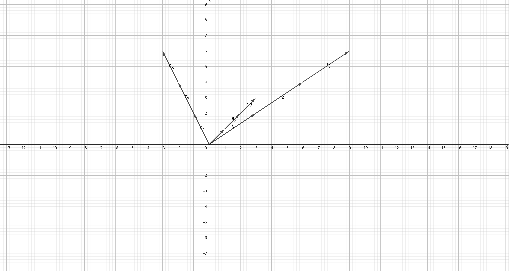
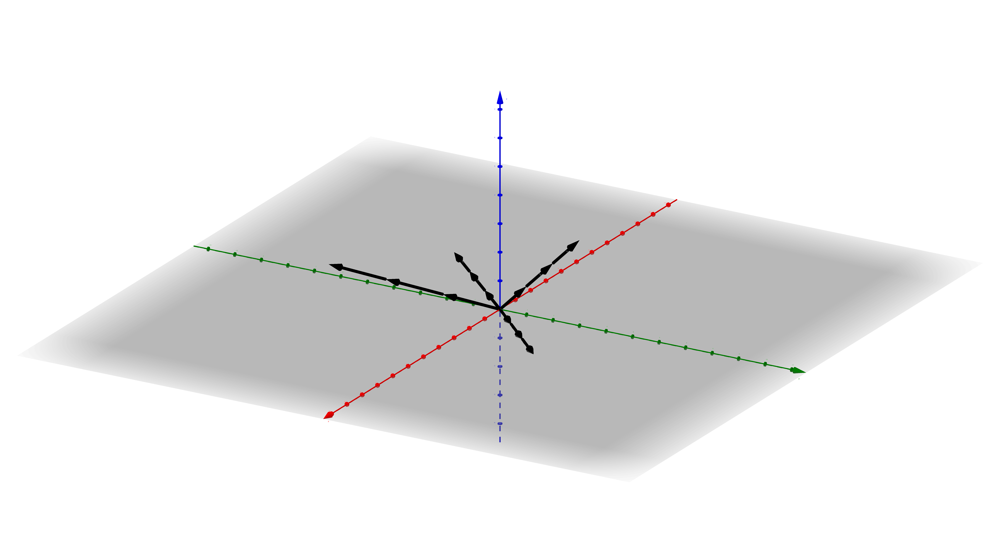

## LB. S. 277
### Nr. 1.

### Nr. 2.

### Nr. 3.
#### a.
$\displaystyle \overrightarrow{AB} = \left(\begin{array}{c}2\newline 4\newline 0\end{array}\right) $
$\displaystyle \overrightarrow{BA} = -\overrightarrow{AB} $
#### b.
$\displaystyle \overrightarrow{AB} = \left(\begin{array}{c}-1\newline 1\newline 3\end{array}\right) $
$\displaystyle \overrightarrow{BA} = -\overrightarrow{AB} $
#### c.
$\displaystyle \overrightarrow{AB} = \left(\begin{array}{c}3\newline -4\newline 1\end{array}\right) $
$\displaystyle \overrightarrow{BA} = -\overrightarrow{AB} $

### Nr. 4.
#### a.
$\displaystyle B(4|-2|6) $
#### b.
$\displaystyle B(-15|10|34) $
#### c.
$\displaystyle A(-19|12|27) $
#### d.
$\displaystyle A(31|-70|-184) $

---

# Hausaufgabe
## LB. S. 277/278, Nr. 5., 6., 7., 10., (12.)

### Nr. 5.
#### a.
$\displaystyle P(-2|1|-3) $

#### b.
$\displaystyle P(2|0|-2) $

#### c.
$\displaystyle P(1|-1|1) $

#### d.
$\displaystyle P(1|-3|-1) $

### Nr. 6.

Damit der Vektor ein Parallelogramm ist, müssen die Vektoren $\overrightarrow{AB}$ und $\overrightarrow{DC}$ gleich sein.

#### a.
Ja

#### b.
Ja

#### c.
Nein

### Nr. 7.
$\displaystyle \overrightarrow{AB} = \left(\begin{array}{c}-5\newline -1\newline -1\end{array}\right) $