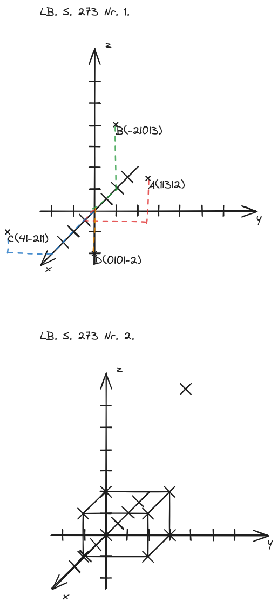

## LB. S. 273
### Nr. 2.
#### b.
$$
\begin{align*}
A&(2|0|0) \\
B&(2|3|0) \\
C&(0|3|0) \\
\textbf{\textit D}&(0|0|0) \\
\textbf{\textit E}&(2|0|2) \\
\textbf{\textit F}&(2|3|2) \\
\textbf{\textit G}&(0|3|2) \\
H&(0|0|2) \\
\end{align*}
$$