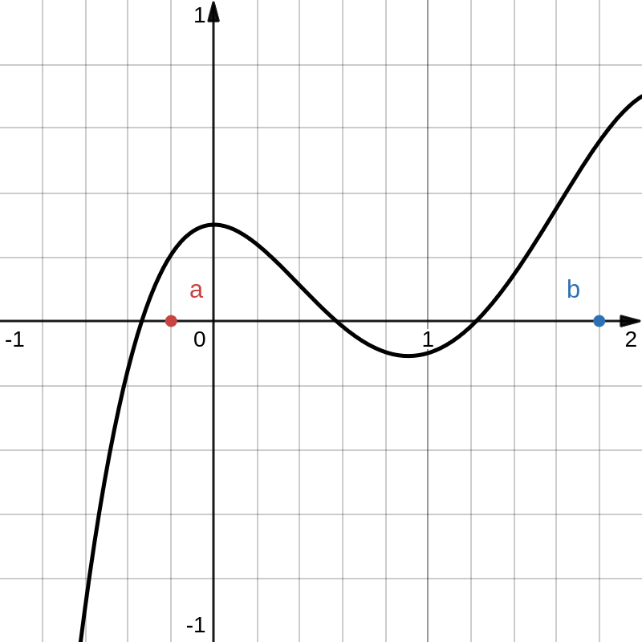

```latex {cmd=true hide latex_zoom=5}
\documentclass[varwidth]{standalone}
\usepackage{xcolor}
\color{white}
\begin{document}
Differentialrechnung 2
\\
\end{document}
```
---

# Integralrechnung

## 1. Flächeninhalte im Sachzusammenhang

`Hier war mal die Aufgabe von Seite 140, aber die war nicht schön formatiert, also hab ich sie rausgenommen`

> ---
> Wenn die Funktion $f$ die momentane Änderungsrate einer Größe in einem Intervall $[a;b]$ beschreibt, lässt sich die orientierte Fläche zwischen dem Graphen von $f$ und der $x$-Achse als *Gesamtveränderung* der Größe zwischen $a$ und $b$ deuten.
> 
> ---

## 2. Das Integral


Die Funktion $f$ (der obrige Graph) sei auf dem Intervall $[a;b]$ differenzierbar.

Man nennt den orientierten Flächeninhalt zwischen dem Graphen von $f$ und der $x$-Achse im Intervall $[a;b]$ das *Integral von $f$ in den Grenzen von $a$ bis $b$*.

Man schreibt:
$$ \int_a^b f(x)dx $$

### Streifenmethode
$$
\begin{align*}
[a;b] &:= \dots \\
n &:= \dots \\
f(x) &:= \dots \\
~\\
\Delta x &= \frac{b-a}n \\
A &\approx \sum_{i=1}^{n} f\left(x_i\right) \Delta x \\
\text{Für }x_i &= \frac{2i-1}n \Delta x
\end{align*}
$$

Der Flächeninhalt wird genauer, wenn die Streifenbreite $\Delta x$ kleiner wird. Demnach erreicht man die maximale Genauigkeit bei $\Delta x \to 0$:

$$
\begin{align*}
A &= \lim_{n\to\infty}\sum_{i=1}^{n} f\left(x_i\right) \frac{b-a}{n} \\
&= \int_a^b f(x)dx
\end{align*}
$$

## 3. Die Stammfunktion
###### $~~~~~~\displaystyle \forall f(x) ~\exists F(x) : F'(x) = f(x) $

> ### Wiederholung zur Ableitung
> 
> #### 1. Bilden Sie die Ableitung
> $$
> \begin{align*}
> f(x) &= \frac12x^4 + \frac1{x^2} \\
> \rightarrow f'(x) &= 2x^3 - 2x^{-3}
> \\~\\
> f(x) &= 7x^4 + 3x^2 + 2\sqrt x \\
> \rightarrow f'(x) &= 28x^3 + 6x + \frac1{\sqrt x}
> \\~\\
> f(x) &= x^7-5 \\
> \rightarrow f'(x) &= 7x^6
> \\~\\
> f(x) &= \sin x + e^{3x^2} \\
> \rightarrow f'(x) &= \cos x + 6xe^{3x^2}
> \\~\\
> \end{align*}
> $$
> 
> #### 2. Gegeben sei die Ableitung $f'$. Geben Sie $f$ an
> $$
> \begin{align*}
> f'(x) &= 2x \\
> \rightarrow f(x) &= x^2 + C
> \\~\\
> f'(x) &= 6x^2 - 4 \\
> \rightarrow f(x) &= 2x^3 - 4x + C
> \\~\\
> f'(x) &= x^2 + 3x + 5 \\
> \rightarrow f(x) &= \frac13x^3 + \frac32x^2 + 5x + C
> \\~\\
> \end{align*}
> $$

| Eine Funktion $F$ heißt *Stammfunktion* zu einer Funktion $f$, wenn für alle $x \in I$ gilt: $$ F'(x) = f(x) $$ $\\$ Sind $F_1$ und $F_2$ Stammfunktionen von $f$ auf einem Intervall $I$, dann gibt es eine Konstante $c$, sodass für alle $x\in I$ gilt: $$ F_1(x) = F_2(x) + c $$ |
|-|

> #### Aufgabe: Geben Sie eine Stammfunktion von $f$ an
> $$
> \begin{align*}
> f_a(x) &= x &\rightarrow F_a(x) &= \frac12x^2 \\
> f_b(x) &= 2x - 8 &\rightarrow F_b(x) &= x^2 - 8x \\
> f_c(x) &= x^2 - 1 &\rightarrow F_c(x) &= \frac13x^3 - x \\
> f_d(x) &= 2x^3 + x &\rightarrow F_d(x) &= \frac12\left( x^4 + x^2 \right)
> \end{align*}
> $$

### Regeln
$$
\begin{align*}
\text{Potenzfunktionen:} \\
f(x) &= x^r \\
\rightarrow F(x) &= \begin{cases}
    \frac1{r+1} x^{r+1} & r \neq -1 \\
    \ln |x| \cdot \text{sgn}~x & r = -1
\end{cases} \\
~\\
\text{Vorfaktoren:} \\
f(x) &= c \cdot u(x) \\
\rightarrow F(x) &= c \cdot U(x) \\
~\\
\text{Summen:} \\
f(x) &= u(x) + v(x) \\
\rightarrow F(x) &= U(x) + V(x) \\
~\\
\text{Lineare Substitution:} \\
f(x) &= u(v(x)) \\
\rightarrow F(x) &= \frac{U(v(x))}{v'(x)}~,\,\text{wenn }v''(x)=0 \\
~\\
\text{Allgemeine Substitution:} \\
f(x) &= \dots \\
\rightarrow F(x) &= \int f(x)dx \\
\rightarrow F(\varphi(x)) &= \int f(\varphi(x))\cdot \varphi'(x)dx ~~|~z := \varphi(x) \\
\rightarrow F(z) &= \int f(z) \frac{dz}{dx}dx \\
&= \int f(z) dz \\
~\\
\text{Produktregel:} \\
f(x) &= u'(x) \cdot v(x) \\
\rightarrow F(x) &= \int f(x)dx \\
&= \int u'(x)v(x)dx \\
&= u(x)v(x) - \int u(x)v'(x)dx
\end{align*}
$$

## 4. Stammfunktion und Integral

### Hauptsatz der Differential- und Integralrechnung

#### Aufgabe: Berechnen Sie das Integral im Intervall $\displaystyle [0;b] $. Geben Sie $F(x)$ (ohne konstante Summanden) an und berechnen Sie $F(b)$.

$\displaystyle f(x), b$|$\displaystyle \int_0^b f(x)dx$|$\displaystyle F(x), F(b)$
-|-|-
$f(x) = x^2, b = 3 $|$9$|$F(x)=\frac13x^3, F(b)=9$
$f(x) = \frac13x^3, b=4$|$\frac{64}3$|$F(x)=\frac1{12}x^4, F(b)=\frac{64}3$
$f(x) = 4\sqrt x, b = 9$|$72$|$F(x)=\frac83\sqrt{x^3}, F(b)=72$
$f(x)=x+4, b=1$|$\frac92$|$F(x)=\frac12x^2+4x, F(b)=\frac92$
$f(x)=\tan x, b=\frac\pi2$|$-1$|$F(x)=-\ln\left\|\cos x\right\|, F(b)=-1$

**Schlussfolgerung:** $\displaystyle \int_0^bf(x)dx = F(b) $

#### Hauptsatz der Differential- und Integralrechnung
Die Funktion $f$ sei differenzierbar auf dem Intervall $[a;b]$. Dann gilt:
$$ \int_a^bf(x)dx = \left[F(x)\right]_a^b = F(b) - F(a) $$
für eine beliebige Stammfunktion $F$ von $f$ auf $[a;b]$.

|Das Integral $\displaystyle \int_a^bf(x)dx $ mit den Grenzen $a$ und $b$ nennt man *bestimmtes Integral* der Funktion $f$. Das *unbestimmte Integral* ist die Menge aller Stammfunktionen von $f$: $\displaystyle \int f(x)dx = \left\{ F(x) + c ~\middle\|~c\in\mathbb R \right\} $.|
|-|

### Rechenregeln
$$
\begin{align*}
\int_a^bf(x)dx &= -\int_b^af(x)dx \\
\int_a^cf(x)dx &= \int_a^bf(x)dx + \int_b^cf(x)dx &&\bigg|~a\leq b\leq c \\
\int_a^b kf(x)dx &= k\int_a^bf(x)dx &&\bigg|~k\in\mathbb R \\
\int_a^b(u(x) + v(x))dx &= \int_a^bu(x)dx + \int_a^bv(x)dx
\end{align*}
$$

## 5. Flächeninhalte oberhalb und unterhalb der x-Achse
### Zwischen zwei Graphen
[https://www.desmos.com/calculator/2lwuw9psas](https://www.desmos.com/calculator/2lwuw9psas)

$$
\begin{align*}
f(x) &= \frac1{50}x^2 + 4 \\
g(x) &= \frac3{50}x^2 \\
I &= [-10;10]
\end{align*}
$$

Berechnen Sie die von den Graphen von $f$ und $g$ vollständig begrenzte Fläche.

$$
\begin{align*}
A &= \int_{-10}^{10}f(x)dx - \int_{-10}^{10}g(x)dx \\
&= \int_{-10}^{10}\left( f(x)-g(x) \right)dx \\
&= \int_{-10}^{10}\left( \frac1{50}x^2 + 4 - \frac3{50}x^2 \right)dx \\
&= \int_{-10}^{10}\left( 4 - \frac1{25}x^2 \right)dx \\
&= \left[ 4x - \frac1{75}x^3 \right]_{-10}^{10} \\
&= 80 - \frac{2000}{75} \\
&= \frac{160}3
\end{align*}
$$

|Wird eine Fläche über dem Intervall $[a;b]$ von den Graphen zweier Funktionen $f$ und $g$ begrenzt und gilt $f(x) \geq g(x)$ für alle $x\in [a;b]$, dann gilt für ihren Inhalt $A$: $$\begin{align*} A &= \int_a^b f(x)dx - \int_a^b g(x)dx \\ &= \int_a^b(f(x)-g(x))dx \end{align*}$$|
|-|

### Flächeninhalte unbegrenzter Flächen
#### Aufgabe: Berechnen Sie den Inhalt der vom Graphen von $f$, der $x$- und der $y$-Achse im $I.$ Quadranten begrenzten Fläche.
##### a.
$$
\begin{align*}
f(x) &= e^{-x} \\
A &= \int_0^\infty e^{-x}dx \\
&= \lim_{z\to\infty} \left[ -e^{-x} \right]_0^z \\
&= \lim_{z\to\infty} \left( -e^{-z} + 1 \right) \\
&= \lim_{z\to\infty} \left( -\frac1{e^z} + 1 \right) &&\Big|~ \lim_{z\to\infty} -\frac1{e^z} = 0 \\
&= 1
\end{align*}
$$

##### b.
$$
\begin{align*}
f(x) &= \frac1{\sqrt x} - 1 \\
A_1 &= \int_1^\infty \left( \frac1{\sqrt x} - 1 \right)dx \\
&= \lim_{z\to\infty} \left[ 2\sqrt x - x \right]_1^z \\
&= \lim_{z\to\infty} \left( 2\sqrt z - z - 1 \right) \\
&= -\infty \\
A_1 &= \int_0^1 \left( \frac1{\sqrt x} - 1 \right)dx \\
&= \lim_{z\to0} \left[ 2\sqrt x - x \right]_z^1 \\
&= \lim_{z\to0} \left( 1 - 2\sqrt z + z \right) \\
&= 1 \\
\end{align*}
$$

## 6. Volumina von Rotationskörpern

Sei $f$ auf $[a;b]$ differenzierbar. Das Volumen des Rotationskörpers, der bei der Rotation um die $x$-Achse über dem Intervall $[a;b]$ entsteht, beträgt:

$$ V = \pi\int_a^b(f(x))^2dx $$