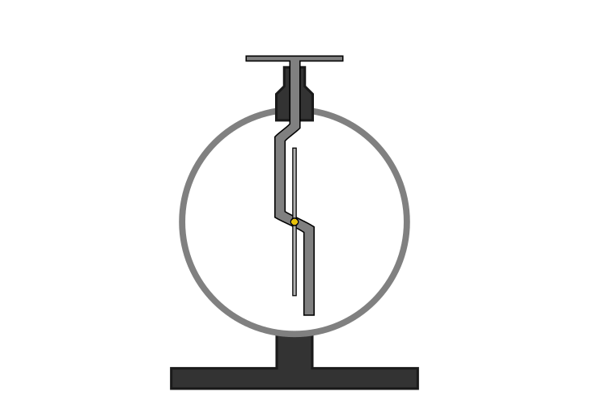
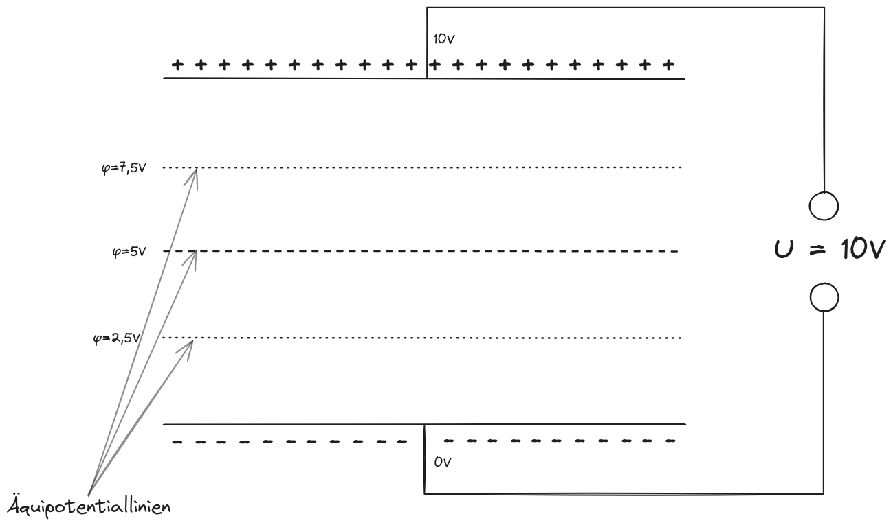

```latex {cmd=true hide latex_zoom=5}
\documentclass[varwidth]{standalone}
\usepackage{xcolor}
\color{white}
\begin{document}
Elektrisches Feld
\\
\end{document}
```
---

# Elektrische Ladungen
Die elektrische Ladung eines Körpers gibt an, wie groß sein Elektronenüberschuss oder -mangel ist. Die Ladung ist eine Eigenschaft, die an Materie gebunden ist. (Protonen sind *elektrisch positiv*, Elektronen *elektrisch negativ*, Neutronen *elektrisch neutral*)

## Kraftwirkungen
Gleich geladene Körper (positiv - positiv oder negativ - negativ) stoßen sich ab, unterschiedlich geladene Körper (positiv - negativ) ziehen sich an.

$$
\begin{align*}
F &\sim Q_1 \cdot Q_2 \\
F &\sim \frac{1}{r^2} \\
F &\sim \frac{Q_1\cdot Q_2}{r^2}
\end{align*}
$$

Doch weder Einheit noch Zahlenwerte würde passen. Wir benötigen noch einen Vorfaktor, der Größenordnung und Einheit korrigiert:

$$
\begin{matrix}
\textbf{Coulombsches Gesetz} \\
\displaystyle F = \frac{1}{4\pi\epsilon_0}\cdot \frac{Q_1\cdot Q_2}{r^2}
\end{matrix}
$$

$$
\begin{align*}
\epsilon_0 &\approx 8,854 \cdot 10^{-12} \frac{\text{As}}{\text{Vm}}
\end{align*}
$$

> Bemerkung: Eigentlich ist das Coulombsche Gesetz exakt $\displaystyle F = \frac{1}{4\pi\epsilon_0\epsilon_r}\cdot \frac{Q_1\cdot Q_2}{r^2} $
> 
> $\displaystyle \epsilon_r $ ist die Permittivitätszahl und beschreibt den Stoff zwischen den Ladungen. Da wir vereinfacht nur den Fall mit Luft betrachten ($ \epsilon_r = 1,0006 \approx 1 $) lassen wir diesen Aspekt unberücksichtigt.

## Phänomene der Ladungstrennung / Ladungsverschiebung

### Reibungselektrizität
Wenn zwei Körper so nah aneinanderkommen, dass die Atomeschichten der zwei Körper untereinander Elektronen austauschen können (bspw. durch Reiben der Körper aneinander), können Elektronen vom einen zum anderen Körper wandern. Wenn dann die Körper wieder voneinnader getrennt werden, kann eine räumliche Trennung der Ladungen stattfinden.

So kann statische Elektrizität aufgebaut werden.

### Elektroskop

Zeiger wandert von Metallstab weg, weil sich gleiche Ladungen abstoßen.

### Influenz
Die Influenz ist die Ladungstrennung in Leitern. Sie kann nur bei elektrisch leitfähigen Stoffen passieren und entsteht bspw. durch die Abstoßung der Elektronen in einem Körper durch die Nähe von Elektronen eines anderen Körpers.

### Polarisation
Die Polarisation ist eine Ladungsverschiebung bei Isolatoren. Wenn Dipole vorhanden sind, können sich Teilladungen der Dipolmoleküle in Richtung nichtnegativ geladener Isolatoren oder anderer nichtnegativer Stoffe ausrichten und von ihnen angezogen werden.

## Ladung
**Formelzeichen**: $Q$
**Einheit**: $[Q] = 1\text{ C (Coulomb)} = 1 \text{ As}$

Jede Ladung ist ein Vielfaches der *Elementarladung* $e\approx1,602\cdot10^{-19} \text{ C}$

$$
\begin{align*}
Q &= k\cdot e &&&k&\in\mathbb Z \\
Q_\text{Elektron} &= -e \\
Q_\text{Proton} &= +e \\
I &= \frac Qt &\text{bzw.}&&I &= \frac{\Delta Q}{\Delta t}
\end{align*}
$$

# Die elektrische Stromstärke

Die Stromstärke gibt an, wie viele Ladungsträger (genauer: welche Ladungsmenge) pro Sekunde durch den Querschnitt eines Leiters fließen.

$$
\begin{align*}
I &= \frac{\Delta Q}{\Delta t} \\
&= \frac{dQ}{dt} \\
\end{align*}
$$

**Der *Strom* ist die Ableitung von der *Ladung***

> Wissenswertes: Weißt du eigentlich, wie schnell sich die Elektronne in einem metallischen Leiter bewegen? Man nennt diese Geschwindigkeit auch "Driftgeschwindigkiet".
> $\displaystyle v_\text{drift} \approx 0,1 \frac{\text{mm}}{\text s} $

# Elektrisches Feld

Ein elektrisches Feld ist der Zustand des Raumes um einen elektrisch geladenen Körper, in dem auf andere elektrisch geladene Körper Kräfte ausgeübt werden.

→ Das Feld vermittelt Kraftwirkungen


Elektrische Feldstärke:
$$
\begin{align*}
\overrightarrow{\mathbb{E}} = \frac{\overrightarrow F_{\text{el}}}{Q}
\end{align*}
~ ~~~~~~
\begin{matrix}
\overrightarrow F_\text{el} &\text{Elektrische Feldkraft} \\
\overrightarrow{\mathbb{E}} &\text{Elektrische Feldstärke} \\
Q &\text{Elektrische Ladung}
\end{matrix}
$$

Einheit: $\displaystyle [\overrightarrow{\mathbb E}] = 1 \frac{\text N}{\text C} = 1 \frac{\text V}{\text m} $

Für das Feld eines einzelnen Ladungsträgers gilt zudem: $\displaystyle \mathbb E \sim \frac1{r^2}$

Darstellung eines elektrischen Feldes?

**Feldlinienbilder!**


* Feldlinien verlaufen immer von Plus zu Minus
* Aus- und Eintrittswinkel der Feldlinien sind immer 90°
* die Feldstärke ist umso größer, je dichter die Linien verlaufen
* Feldlinien sind nicht in sich geschlossen

## Spezielle Felder

Siehe PowerPoint LB 5

## Faradayscher Käfig

Der faradaysche Käfig (auch Faradaykäfig) ist eine allseitig geschlossene Hülle aus einem elektrischen Leiter (z. B. Drahtgeflecht oder Blech), die als elektrische Abschirmung wirkt. Bei äußeren elektrischen Feldern bleibt der innere Bereich infolge der Influenz feldfrei.

Es entsteht innerhalb des Käfigs ein Feld in entgegengesetzter Richtung mit der selbigen Stärke, was das ursprüngliche Feld im Käfig aufhebt. Demanch *kompensieren* sich beide Felder.

## Sonderfall: Elektrische Feldstärke im Plattenkondensator

Das elektrische Feld im Inneren eines Plattenkondensators kann wiefolgt berechnet werden:
$$ \mathbb E = \frac{U}{d} $$

## Der Milikan-Versuch
###### Experiment zum Bestimmen der Elementarladung

Siehe [PowerPoint](./PowerPoints/LB%205%20Elektrisches%20Feld.pdf)

## Energieumwandlungen und Arbeit im elektrischen Feld

### Heben eines Körpers im Gravitationsfeld
$$
\begin{align*}
\Delta E_\text{pot} &= W_\text{hub} \\
&= F_G \cdot s \\
&= m\cdot g\cdot\Delta h \\
&= m\cdot g\cdot h &(\text{bei Wahl von }h=0)
\end{align*}
$$

### Bewegen einer Ladung im elektrischen Feld
$$
\begin{align*}
\Delta E_\text{pot} &= W_\text{verschiebung} \\
&= F_\text{el} \cdot s \\
&= q\cdot \mathbb E \cdot s \\
\end{align*}
$$

## Elektrisches Potential

Unter dem elektrischen Potential eines Punktes in einem elektrischen Feld versteht man den Quotienten aus der potentiellen Energie des Körpers im Feld und der Ladung des Körpers.

**Formelzeichen**: $\varphi$
**Einheit**: $\displaystyle \varphi = 1 \frac{\text J}{\text C} = 1 \text{ V}$

$$
\begin{align*}
\varphi &= \mathbb E \cdot s \\
&= \frac{E_\text{pot}}{q}
\end{align*}
$$

Die *elektrische Spakkung* ist gleich der Potentialdifferenz zwischen zwei Punkten des elektrischen Feldes:
$$ U = \Delta\varphi = \varphi_2 - \varphi_1 $$

Aufbau eines Plattenkondensators:



Die Äquipotentiallinien und elektrischen Feldlinien stehen senkrecht zueinander.

# Kondensator
###### Elektrostatische Speicherung

Der Kondensator ist ein Bauelement zur Speicherung elektrischer Ladungen und Energie. Jeder Kondensator besteht aus zwei metallischen Flächen. Dazwischen liegt ein Isolierstoff, das Dielektrikum. Zwischen den matallischen Flächen kann der Kondensator eine elektrische Ladung speichern.

Die Speicherfähigkeit eines Kondensators wird als Kapazität bezeichnet. Sie wird auch als Ladungsfassungsvermögen bezeichnet.

**Formelzeichen**: $C$
**Einheit**: $\displaystyle [C] = 1 \text{ F (Farad)} = 1 \frac{\text C}{\text V} $

$$
\begin{align*}
C &= \frac{Q}{U} \\
&= \epsilon_0 \cdot \epsilon_r \cdot \frac{A}{d}
\end{align*}
$$

> ## Eselsbrücke: Die "Ku-Ku-Regel" $Q = C \cdot U$
> In der zweiten Gleichung wird deutlich, dass für eine große Speicherung von Ladungen eine große Kapazität und eine hohe Ladespannung erforderlich sind.
> 
> **Proportionalitäten**:
> $$ Q \sim C ~~~~~ Q \sim U ~~~~~ C \sim \frac1U $$

$$ C \sim \frac1d ~~~~~ C \sim A $$

#### Wie bewirkt das Einbringen eiens Dielektrikums eine bessere Speicherung von Ladungen?
Das Dielektrikum ist ein Nichtleiter, der durch das äußere elektrische Feld polarisiert wird. Durch die Polarisierung "hält" das Dielektrikum mehr Ladungen auf dem Kondensator (Bindung der Oberflächenladung). Die Dielektrizitätskonstante (Permittivitätszahl) stellt somit auch ein Maß für die Polarisierbarkeit des Dielektrikums dar.

#### Gleichung für die gespeicherte Energie
$$
\begin{align*}
E &= \frac12CU^2
\end{align*}
$$