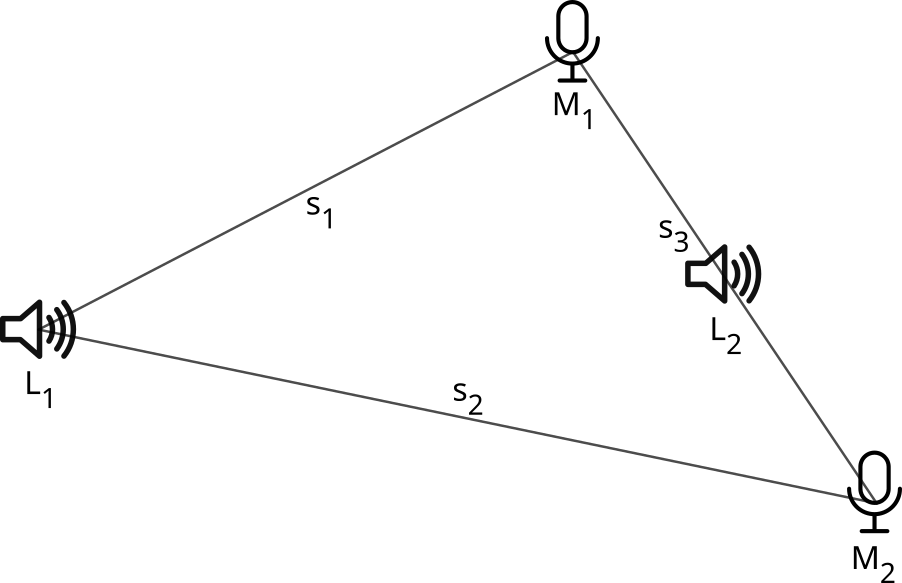

# Experiment - Bestimmung der Schallgeschwindigkeit

## Durchführung
* Mikrofone an beiden mit Mikrofon gekennzeichneten Positionen in Abbildung platzieren
* Distanzen Messen
* an Position $L_2$ einen Ton abspielen
* an Position $L_1$ den selben Ton abspielen
* Zeitabstand bei Aufzeichnungen beider Mikrofone zw. erstem und zweitem Ton messen
* Mit Differenz zwischen beiden Zeitabständen rechnen:
    $\displaystyle v = \frac{\Delta s}{\Delta t} $

$$
\begin{align*}
s_1 &= 50 \text{ cm} \\
s_2 &= 100 \text{ cm} \\
s_3 &= 28,6 \text{ cm}
\end{align*}
$$

$$
\begin{align*}
s &= v_\text{Schall} \cdot t \\
\rightarrow v_\text{Schall} &= \frac{s}{t} \\
&= \frac{s_2-s_1}{\Delta t}
\end{align*}
$$

Wir haben zwei Tonaufnahmen mit den jeweils unterschiedlich positionierten Mikrofonen aufgenommen, bei denen wir einmal bei gleichem Abstand zu beiden Mikrofonen (siehe $s_3$) und danach bei unterschiedlichem Abstand zu beiden Mikrofonen (siehe $s_1$ und $s_2$) geklatscht haben. Der Unterschied in Zeitabständen zwischen beiden Klatschern auf beiden Tonaufnahmen wurde nun zur Rechnung als $\Delta t$ genutzt, um die Schallgeschwindigkeit annähernd zu bestimmen.

$$
\begin{align*}
t_1 &= 8,2894 \text{ s} - 1,2545 \text{ s} \\
&= 7,0349 \text{ s} \\
t_2 &= 8,2909 \text{ s} - 1,2545 \text{ s} \\
&= 7,0364 \\
\Delta t &= t_2 - t_1 \\
&= 0,0015 \text{ s}
\end{align*}
$$

## Deutung

Mit den gemessenen Werten kann nun die Schallgeschwindigkeit bestimmt werden

$$
\begin{align*}
v_\text{Schall} &= \frac{s_2-s_1}{\Delta t} \\
&= \frac{1 \text{ m} - 0,5 \text{ m}}{0,0015 \text{ s}} \\
&\approx 333 \frac{\text m}{\text s}
\end{align*}
$$

## Fehlerquellen
### Quellen
* Position des Geräusches ist nicht genau auf ermessener Position, da geklatscht wurde
* Distanz ist klein, dadurch wird Endresultat ungenauer durch andere Fehlerquellen
* Abtastrate von Aufnahme beträgt nur $48.000 \text{ Hz}$, dadurch Ungenauigkeit von bis zu $ \frac{1}{48.000} \text{ s} $ in Zeitmessung

### Möglicheiten zur Verbesserung
* exaktere Geräuschquelle als Klatschen nutzen
* größere Distanzen zwischen Mikrofon & Mikrofon sowie zwischen Mikrofon & Lautsprecher
* höhere Abtastrate für höhere Genauigkeit in der Zeitmessung