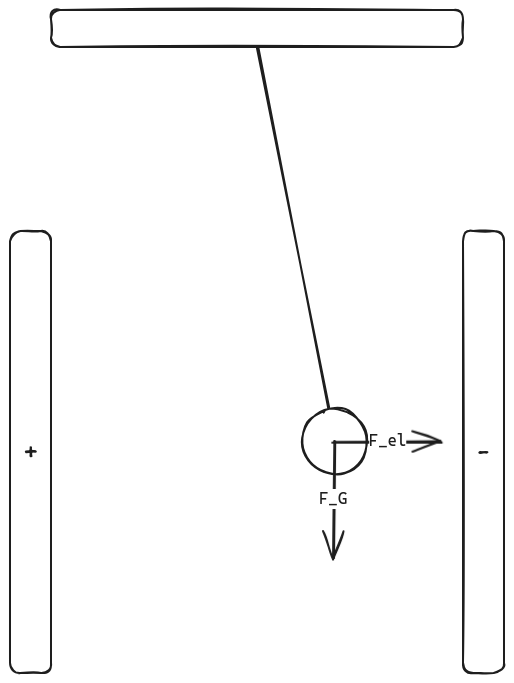

## LB. S. 295
### Nr. 15.
$$
\begin{align*}
d &\colonequals 3,2 \text{ cm} \\
&= 0,032 \text{ m} \\
U &\colonequals 1,5 \text{ kV} \\
&= 1500 \text{ V} \\
q &\colonequals 20 \text{ nC} \\
&= 2\cdot10^{-8} \text{ C}
\end{align*}
$$

$$
\begin{align*}
E &= \frac{U}{d} \\
&= \frac{F}{q} \\
\rightarrow F &= \frac{Uq}{d} \\
&\approx 0,94\cdot10^{-3} \text{ N} \\
&\approx 0,94 \text{ mN}
\end{align*}
$$

### Nr. 14.
$$
\begin{align*}
U &\colonequals 55 \text{ V} \\
d &\colonequals 20 \text{ cm} \\
&= 0,2 \text{ m}
\end{align*}
$$
#### a.
$$
\begin{align*}
\mathbb E &= 2,75 \frac{\text V}{\text m}
\end{align*}
$$

#### b.
$$
\begin{align*}
q &\colonequals 3,2 \cdot 10^{-8} \text{ C} \\
h &\colonequals \frac d2 \\
E_\text{pot} &= mgh \\
&= F_g \cdot h \\
\rightarrow E_\text{pot} &= F_\text{el}s \\
&= \mathbb E \cdot q \cdot s \\
&= 8,8\cdot10{-9} \text{ J}
\end{align*}
$$

## S. 296
### Nr. 17.
$$
\begin{align*}
l &\colonequals 1,5 \text{ m} \\
m &\colonequals 0,5 \text{ g} \\
s &\colonequals 5 \text{ cm} \\
&= 0,05 \text{ m}
\end{align*}
$$
#### a.

#### b.
$$
\begin{align*}
F_el &= F_G \sin\alpha \\
\alpha &= \arcsin \frac{0,05 \text{ m}}{1,5 \text{ m}} \\
\rightarrow F_el &= F_G \cdot \tan\left(\arcsin \frac{0,05}{1,5}\right) \\
&\approx 1,64 \text{ mN}
\end{align*}
$$

### Nr. 20.
$$
\begin{align*}
m &\colonequals 0,15 \text{ g} \\
&= 0,00015 \text{ kg} \\
Q &\colonequals +5\cdot10^{-9} \text{ C} \\
d &\colonequals 5,0 \text{ cm} \\
&= 0,05 \text{ m} \\
\end{align*}
$$

#### a.
Nö

#### b.
$$
\begin{align*}
E &= \frac{F}{Q} \\
&= \frac{U}{d} \\
\rightarrow U &= \frac{Fd}{Q} \\
F &= F_G \\
\rightarrow U &\approx 14.715 \text{ V}
\end{align*}
$$