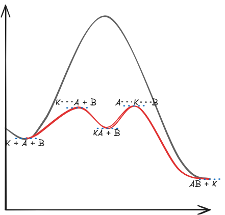

# III. Chemische Gleichgewichte
---

# Katalysator

#### Definition
* verringert (oder erhöht) Aktivierungsenergie
    → beschleunigt chemische Reaktion
* geht unverändert aus Reaktion hervor
* Unterscheidung zwischen positivem und negativem Katalysator (jeweils Senkung/Erhöhung von $E_A$)
* ist selektiv, also wirkt nur bei bestimmten Reaktionen

#### Wirkungsweise
Grundlage ist die Fähigkeit, so in den Mechanismus der Reaktion einzugreifen, dass die Aktivierungsenergie herabgesetzt wird ($\displaystyle E_A \rightarrow E_K $). Der Katalysator bildet einen Übergangszustand, indem er sich an das Edukt $A$ bindet ($K - A$), dadurch lockern sich die Bindungen und das Edukt $B$ kann besser mit $A$ reagieren. Daraufhin bildet sich ein zweiter Übergangszustand $A - K - B$, die Edukte reagieren miteinander und es entsteht das Produkt $AB$. Der Katalysator $K$ liegt nach der Reaktion unverändert vor.

#### Verwendung
* Abgaskatalysator im Auto
* Ammoniakherstellung

#### Arten von Katalysatoren
Es gibt zwei Arten von Katalyse: **homogene** und **heterogene Katalyse**

**Homogene Katalyse:**
* Katalysator und Edukte liegen in den selben Phasen bzw. Aggregatszuständen vor
    → schwieriges Abtrennen des Katalysators

Beispiel: Säurekatalyse

**Heterogene Katalyse:**
* Katalysator und Edukte ligen in unterschiedlichen Phasen bzw. Aggregatszuständen vor

Beispiel: Katalysator im Auto

Man kann auch eine andere Unterteilung vornehmen, nämlich in **Auto-** und **Biokatalyse**

**Autokatalyse**
* Produkt hat selbst katalytische Wirkung auf die Reaktion
* während der Reaktion wird diese zunehmend beschleunigt
* Beispiel: Reaktion von Oxalsäure mit Kaliumpermanganat

**Biokatalyse**
* Enzyme als Katalysator
* Beispiele: Herstellung von Aspartam, Vitamin C; alle stoffwechselvorgänge des Organismus; biochemische Reaktionen