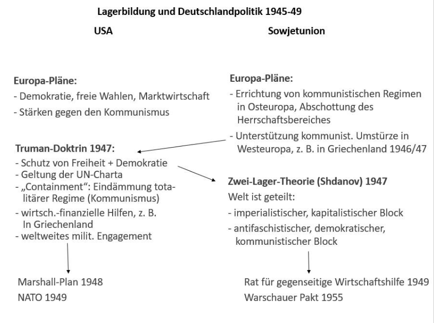

## Situation Deutschlands nach Kriegsende 1945
* **Zusammenbruchsgesellschaft** - Wirtschaft, Infrastruktur, Städte großflächig zerstört
* Kohleförderung und Industrieproduktion fast vollständig lahmgelegt, fehlende Transportkapazitäten
* **Hunger** - vor allem in den Städten fehlt Nahrung, mehrere Hungerwinter bis 1948
	* -> Rationierung durch Lebensmittelkarten, florierender Schwarzmarkt, "Hamsterfahrten"
* **Wohnungsnot** aufgrund der Bombardierungen (1946: 8 Mio. Wohnungen für 14 Mio. Haushalte)
	* zunächst Trümmerbeseitigung zur Vorbereitung des Wiederaufbaus
* 11 Mio. Deutsche in Kriegsgefangenschaft
* Ankunft von Millionen Flüchtlingen aus ehemaligen Ostgebieten; Familien werden auseinandergerissen
## Wichtige Beschlüsse der Potsdamer Konferenz (17.07. - 02.08.1945)
* **territorial** - *Oder-Neiße-Linie* als vorläufige polnische Westgrenze, Königsberg geht an Sowjetunion
	* endgültige Grenzregelung aufgeschoben bis zum Abschluss eines Friedensvertrages
* Beschloss zur Umsiedlung der deutschen Bevölkerung aus den ehemaligen Ostgebieten
	* "in ordnungsgemäßer und humaner Weise"
* **Ablehnung der Teilung Deutschlands**, vorläufige Regierung/Verwaltung durch einen **Alliierten Kontrollrat**
	* auch wirtschaftlich soll Deutschland als Einheit behandelt werden
* Festschreibung der **Besatzungszonen**
* **Reparationen** in Form von Demontagen (Fabrikanlagen und Infrastruktur), Deutschland werden "genügend Mittel belassen, um ohne eine Hilfe von außen zu existieren"
* Formulierung der sogenannten **4 D**:
	* **Denazifizierung** - Nürnberger Hauptkriegsverbrecherprozesse, Auflösung der NSDAP, Entlassung von belasteten Beamten, Durchführung von Entnazifizierungsverfahren
	* **Demilitarisierung** - Auflösung der Wehrmacht, Vernichtung des Rüstungsmaterials und Rückbau der Rüstungsfabriken
	* **Dezentralisierung** - Zerschlagung der Großkonzerne (z.B. IG Farben), Verhinderung der Bildung großer Kartelle
	* **Demokratisierung** - Wiedererrichtung der Demokratie, Gewährung von Grundrechten, Neubildung von Parteien, Durchführung freier Wahlen
## Der Weg zur deutschen Teilung
### Eiserner Vorhang
* abriegelnde und scharf bewachte Grenze zwischen dem kommunistischen Osten und demokratischen Westen Europas
* Begriff maßgeblich von Winston Churchill geprägt
* **Probleme:**
	* **Spannung zwischen Ost und West** - Churchill warnt vor zunehmender Einflussnahme der UdSSR in Mittel- und Osteuropa
	* **Ausbreitung des Kommunismus** - Kritik an Großziehen kommunistischer Parteien unter sowjetischer Kontrolle, Anstreben totalitärer Macht dieser
	* **Eiserner Vorhang** - Europa ist durch politische und ideologische Grenze geteilt
	* **fehlendes "befreites Europa"** - Ziel eines freien, friedlichen Europas nach WWII durch sowjetische Dominanz verhindert
	* **Gefahr neuer Konflikte** - Hindeutung auf kalten Krieg, aufgrund von Misstrauen, Machtkampf und ideologischer Spaltung zwischen Supermächten
### Lagerbildung und Deutschlandpolitik 1945-1949

