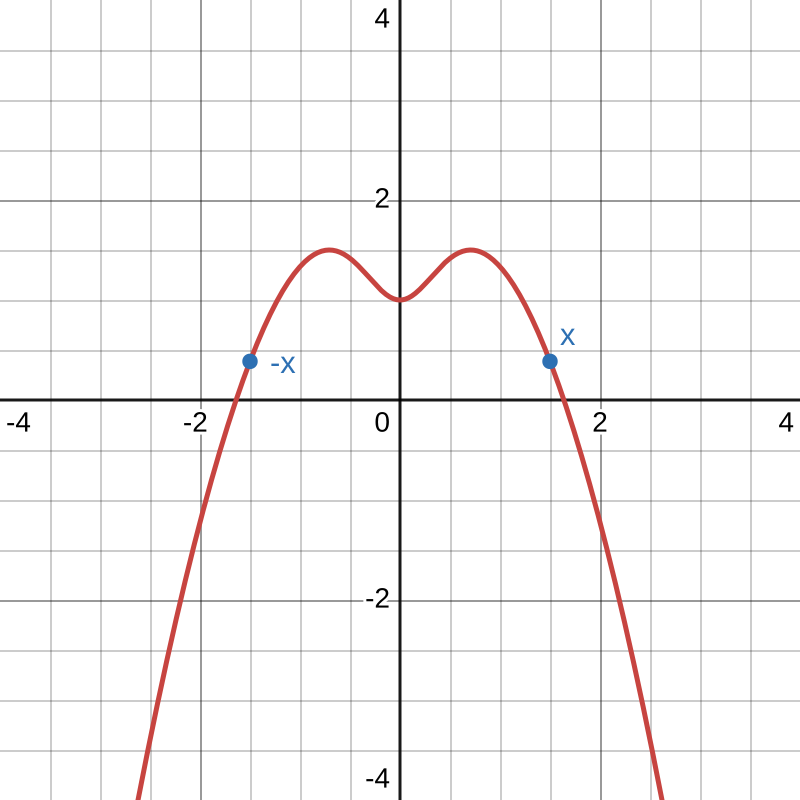
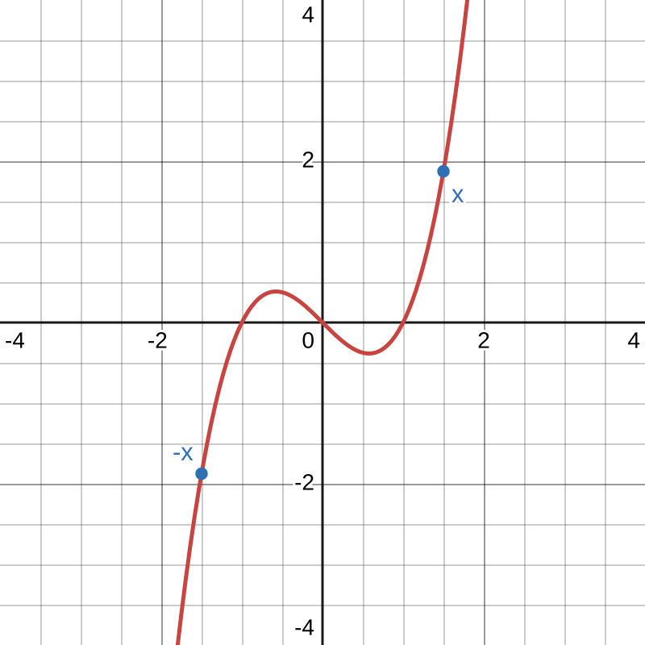
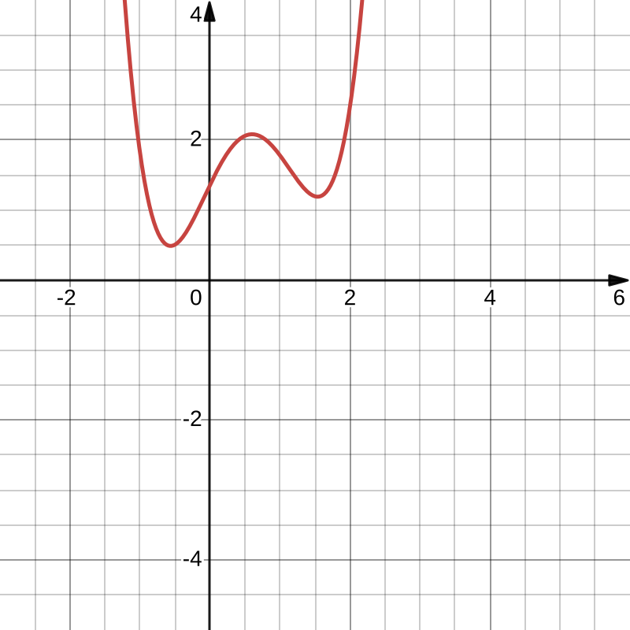
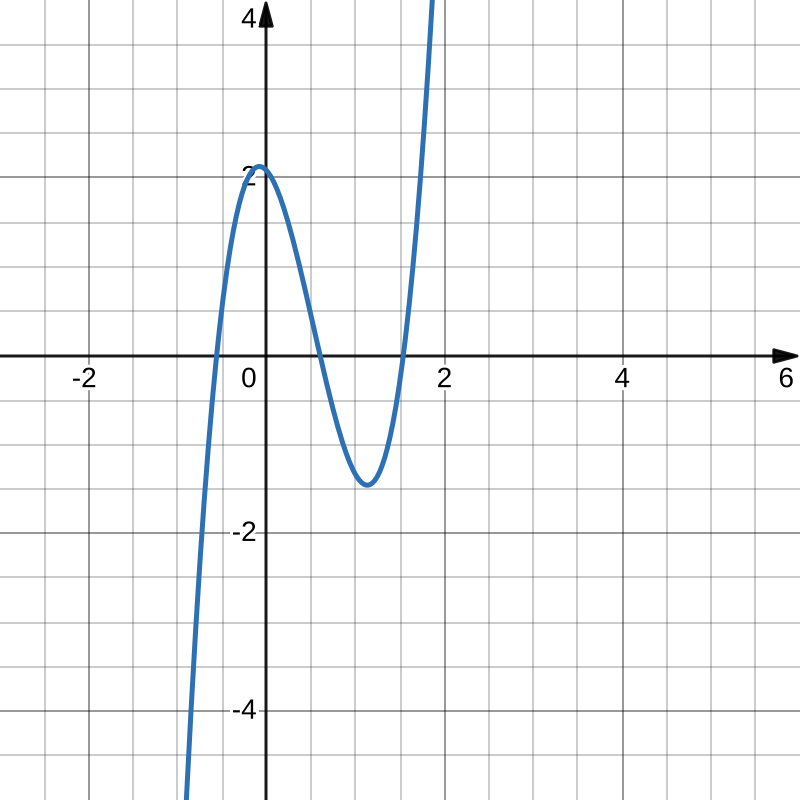
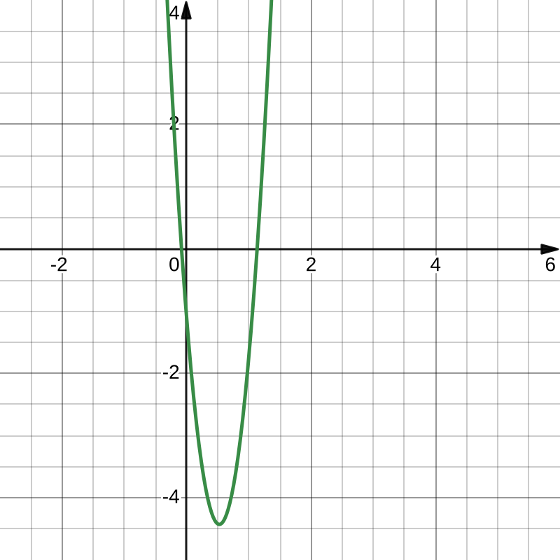

# Differentialrechnung
---

# 4 Untersuchung von Funktionsgraphen

`Hier wäre ein cooler Graph, der viele Punkte und Verhalten, die man an einem Graphen nachweisen kann, auflistet, aber ich kannte die Funktionsgleichung nicht und war deswegen zu faul das ganze nachzuzeichnen.`

## 4.1 Symmetrie

#### Der Graph von $f$ verläuft:
* **achsensymmetrisch zur $y$-Achse (gerade Funktion)**
    
    |$$ f(x) = f(-x) $$|
    |-|
* **punktsymmetrisch zum Koordinatenursprung (ungerade Funktion)**
    
    |$$ f(x) = -f(-x) $$|
    |-|

#### Beispiele

##### a. $\displaystyle f(x) = -2x^6 + 3x^2 $

$$
\begin{align*}
f(-x) &= -2\cdot(-x)^6 + 3\cdot(-x)^2 \\
&= -2x^6 + 3x^2 \\
&= f(x)
\\~\\
\Rightarrow&\text{ Achsensymmetrisch zur}\\
&~y\text{-Achse} \\
\Rightarrow&~f(x)\text{ ist eine gerade}\\
&\text{ Funktion}
\end{align*}
$$

#### $~$
##### b. $\displaystyle f(x) = x^3 - x $

$$
\begin{align*}
f(-x) &= (-x)^3 - (-x) \\
&= -x^3 + x \\
&= -(x^3-x) \\
&= -f(x)
\\~\\
\Rightarrow&\text{ Punktsymmetrisch zum}\\
&\text{ Koordinatenursprung} \\
\Rightarrow&~f(x)\text{ ist eine ungerade}\\
&\text{ Funktion}
\end{align*}
$$

### Symmetrie ganzrationaler Funktionen

$\displaystyle f(x) = x^6+3x^4-5x^2+2 $

Sind alle Exponenten gerade, so ist die Funktion gerade.

$\displaystyle f(x) = 3x^5-x^3+5x $

Sind alle Exponenten ungerade, so ist die Funktion ungerade.

Wenn man eine genzrationale Funktion in zwei Unterfunktionen $u(x)$ und $v(x)$ einteilen kann, sodass $\displaystyle f(x) = u(x) + v(x) $ (z.B. $\displaystyle f(x) = x^4+3x^2 ~~\rightarrow~~ u(x) = x^4 ~;~~ v(x) = 3x^2 $), dann gilt:

|Die Funktion $f(x)$ ist gerade, wenn beide Funktionen $u(x)$ und $v(x)$ gerade sind. Wenn beide Funktionen $u(x)$ und $v(x)$ ungerade sind, ist auch $f(x)$ ungerade. Wenn die Geradigkeit von $u(x)$ nicht mit der von $v(x)$ übereinstimmt, hat $f(x)$ keine Standardsymmetrien.|
|-|

Hier ein Beispiel:

$$
\begin{align*}
f(x) &= 4x^2 + 3x^6
\\~\\
\rightarrow ~~&\text{Kann unterteilt werden:}\\
u(x) &= 4x^2 \\
v(x) &= 3x^6 \\
f(x) &= u(x) + v(x) \\
&= 4x^2 + 3x^6
\\~\\
\rightarrow ~~&u(x)\text{ ist \textbf{gerade} und} \\
&v(x) \text{ ist \textbf{gerade}, deshalb} \\
&\text{ist }f(x)\textbf{ gerade}\text{.} \\
\Rightarrow ~~&f(x)\text{ ist \textbf{achsensymmetrisch}} \\
&\text{zur y-Achse.}
\end{align*}
$$

Hier ein weiteres Beispiel:

$$
\begin{align*}
f(x) &= 4x^3 + 3x^5 + 5x^{9}
\\~\\
\rightarrow ~~&\text{Kann unterteilt werden:}\\
u(x) &= 4x^3 \\
v(x) &= 3x^5 + 5x^{9} \\
f(x) &= u(x) + v(x) \\
&= 4x^3 + (3x^5 + 5x^{9})\\
&= 4x^3 + 3x^5 + 5x^{9}
\\~\\
\rightarrow ~~&u(x)\text{ ist \textbf{ungerade} und} \\
&v(x) \text{ ist \textbf{ungerade}, deshalb} \\
&\text{ist }f(x)\textbf{ gerade}\text{.} \\
\Rightarrow ~~&f(x)\text{ ist \textbf{punktsymmetrisch}} \\
&\text{zur y-Achse.}
\end{align*}
$$
`Bei dem zweiten Beispiel konnte man v(x) auch nochmal unterteilen in zwei Unterfunktionen, die beide ungerade sind, deshalb ist v(x) insgesamt ungerade.`

### Symmetrie gebrochenrationaler Funktionen

> #### Hausaufgabe: Untersuche auf Symmetrie
> 
> $\displaystyle f(x) = \frac{x^4-3x^2+1}{x^2+5} $
> y-Achsensymmetrie
> 
> $\displaystyle f(x) = \frac{5x^3-4x}{x^7+x} $
> y-Achsensymmetrie
> 
> $\displaystyle f(x) = \frac{2x^3+x}{5x^2-1} $
> Punktsymmetrie
> 
> $\displaystyle f(x) = \frac{4x^6-x^4}{x^3+2x} $
> Punktsymmetrie
> 
> $\displaystyle f(x) = \frac{x^3+x^2}{x^2-1} $
> Keine Standardsymmetrie

Wenn man eine gebrochenrationale Funktion in zwei Unterfunktionen $u(x)$ und $v(x)$ einteilen kann, sodass $\displaystyle f(x) = \frac{u(x)}{v(x)} $, dann gilt folgendes für die Geradigkeit (also ob sie gerade oder ungerade ist) der Funktion $f(x)$:

|Die Funktion $f(x)$ ist gerade, wenn beide Funktionen $u(x)$ und $v(x)$ die selbe Geradigkeit besitzen. Wenn $u(x)$ und $v(x)$ jedoch unterschiedliche Geradigkeiten besitzen, ist $f(x)$ ungerade.|
|-|

Hier ein Beispiel:
$$
\begin{align*}
f(x) &= \frac{x^2+4x^4}{2x^5-x^3}
\\~\\
\rightarrow ~~&\text{Kann unterteilt werden:}\\
u(x) &= x^2+4x^4 \\
v(x) &= 2x^5-x^3 \\
f(x) &= \frac{u(x)}{v(x)} \\
&= \frac{x^2+4x^4}{2x^5-x^3}
\\~\\
\rightarrow ~~&u(x)\text{ ist \textbf{gerade}, aber} \\
&v(x) \text{ ist \textbf{ungerade}, deshalb} \\
&\text{ist }f(x)\textbf{ ungerade}\text{.} \\
\Rightarrow ~~&f(x)\text{ ist \textbf{punktsymmetrisch}} \\
&\text{zum Koordinatenursprung.}
\end{align*}
$$

## 4.2 Extrempunkte

`Hier müsste ein Graph von einer Funktion, die lokale Extrempunkte, global Extrempunkte und Sattelpunkte zeigt, aber ich kriegs nicht hin, die Funktion zu reproduzieren, deswegen kann ich den Graphen davon nicht generieren :(`

#### Lokale Extrempunkte, Globale Extrempunkte und Sattelpunkte

Extrempunkte sind schon bekannt: Es sind punkte, an denen sich die Monotonie einer Funktion ändert, die ähnlich wie Berge oder Hügel aussehen. Der Unterschied zwischen lokalen und globalen Extrempunkten besteht darin, dass globale Extrempunkte *den höchsten bzw. tiefsten y-Wert des ganzen Graphen haben*, während sich bei lokalen Extrempunkten *nur die Monotonie ändert*.

Sattelpunkte sind ähnlich zu Extrempunkten, mit dem Unterschied, dass sich die Monotonie nicht ändert: Extrempunkte haben neben ihrer Änderung der Monotonie auch die Eigenschaft, dass die Ableitung an der x-Stelle des Punktes gleich $0$ ist. Sattelpunkte teilen diese Eigenschaft mit Extrempunkten.

### Notwendige Bedingung zur Bestimmung von Extrema oder Sattelpunkten
Besitzt die Funktion $f$ im Intervall $I$ eine lokale Extremstelle $x_0$, so gilt: $f'(x_0) = 0$.

### Erste hinreichende Bedingung zur Unterscheidung von Extrema und Sattelpunkten
Gilt $f'(x_0) = 0$ und hat $f'$ an der Stelle $x_0$ einen Vorzeichenwechsel, von
1. \+ nach -, dann hat $f(x)$ an der Stelle ein lokales Maximum,
2. \- nach +, dann hat $f(x)$ an der Stelle ein lokales Minimum.

Liegt *kein* Vorzeichenwechsel vor, so besitzt der Graph von $f$ an der Stelle $x_0$ einen Sattelpunkt.

### Zweite hinreichende Bedingung zur Unterscheidung von Extrema und Sattelpunkten

> #### Bedeutung der 2. Ableitung für Extremstellen
> Die Ableitung der Ableitung nennt man *2. Ableitung*: $\displaystyle f''(x) $.

Die Funktion $f$ sei auf einem Intervall $I = [a;b]$ beliebig oft differenzierbar und $\displaystyle x_0 \in I $.

Wenn $\displaystyle f'(x_0) = 0 $ und $\displaystyle f''(x) < 0 $ gelten, hat $f$ an der Stelle $x_0$ ein **lokales Maximum**.
Wenn $\displaystyle f'(x_0) = 0 $ und $\displaystyle f''(x) > 0 $ gelten, hat $f$ an der Stelle $x_0$ ein **lokales Minimum**.
Wenn jedoch $\displaystyle f'(x_0) = 0 $ und $\displaystyle f''(x) = 0 $ gelten, kann die Art des Extremums nicht bestimmt werden und die Funktion $f$ kann an der Stelle $x_0$ ein *lokales Minimum*, *lokales Maximum* **oder einen Sattelpunkt** haben. Zur weiteren Bestimmung der Art des Punktes kann die nächste gerade Ableitung der Funktion $f$ gebildet und die selbe Regel angewandt werden.

## 4.3 Monotonie

Wenn $f'(x) < 0$, dann streng monoton fallend, wenn $f'(x) > 0$, dann streng monoton steigend, wenn $f'(x) = 0$, dann sowohl mon. steigend als auch fallend (aber nicht streng, denn bei strenger Monotonie wird $f'(x) = 0$ ausgeschlossen).

## 4.4 Krümmungsverhalten und Wendepunkte

Die Krümmung beschreibt das Vorzeichen der Änderungsrate der Ableitung der Funktion. An Wendepunkten ändert der Graph seine Krümmung: Von einer Rechts- in eine Linkskrümmung oder andersherum.

$f(x):$

$f'(x):$

$f''(x):$

|Angenommen, die Funktion $f$ ist auf dem Intervall $I = [a;b]$ zwimal differenzierbar, dann gilt: Der Graph von $f$ kann einen Wendepunkt an der Stelle $x_w$ haben, wenn gilt: $f''(x_w) = 0 ~\land~ f'''(x_w) \neq 0$|
|-|

## Exkurs - Lösen komplexer Gleichungen

### 1. $\displaystyle x^4-2x^2-3 = 0 $
###### Biquadratische Gleichung
Löst man über substitution (in diesem Fall $z = x^2$)
$$
\begin{align*}
x^2 &= 1 \pm \sqrt{4} \\
\rightarrow x &= \pm\sqrt{1\pm2} \\
&\in \left\{ \sqrt3; -\sqrt3; i; -i \right\}
\end{align*}
$$

### 2. $\displaystyle 2x^4=8x^2-6 $
$$
\begin{align*}
-2x^4+8x^2-6 &= 0 \\
x^4 - 4x^2 + 3 &= 0 \\
\rightarrow x^2 &= 2 \pm \sqrt{ 4-3 } \\
&= 2\pm1 \\
\rightarrow x &= \pm\sqrt{2\pm1}\\
&\in\left\{ \sqrt 3; -\sqrt 3; 1; -1 \right\}
\end{align*}
$$

### 3. $\displaystyle e^{2x} - 6e^x + 8 = 0 $
$$
\begin{align*}
z &:= e^x \\
\rightarrow z^2 - 6z + 8 &= 0 \\
\rightarrow e^x &= 3 \pm 1 \\
\rightarrow x &= \ln(3\pm1) \\
&\in \left\{ \ln2; \ln4 \right\}
\end{align*}
$$