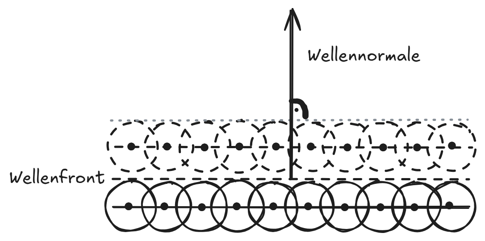
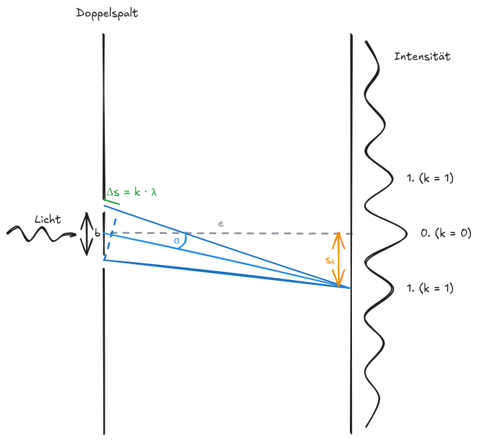

# Mechanische und elektromagne- 
tische Wellen
---


Eine Welle ist eine Ausbreitung einer Störung im Raum. Ist die Störung periodisch, entsteht eine sich ausbreitende Schwingung. Diese Definition einer Welle gilt sowohl für mechanische Wellen als auch für elektromagnetische Wellen.

## Mechanische Wellen
Eine mechanische Welle ist die räumliche Ausbreitung einer mechanischen Schwingung im Raum. Alle mechanischen Wellen benötigen ein Medium, in dem sie sich ausbreiten können, ein sogenanntes Wellenmedium. Ein Wellenmedium besteht aus einer Reihe von Oszillatoren, die untereinander verbunden sind. Durch diese Kopplung kann ein Oszillator auf seinen Nachbarn Kraft ausüben (Kopplungskräfte) und seine Bewegung übertragen. Jeder Oszillator bewegt sich dabei immer nur um seine Ruhelage.

### Voraussetzungen
* Oszillatoren (bspw. schwingungsfähige Teilchen)
* Kopplungskräfte zwischen den Oszillatoren
* mind. einmalige Energiezufuhr

### Merkmale
* Energie- und Impulstransport (Übertragung von einem Ort zum anderen, aber ohne Transport von Materie, aus der sie bestehen – *Energietransport ohne Stofftransport*)
* Medium
* Kopplung

### Größen
* Periodendauer $T$
* Frequenz $f$
* Amplitude $\hat y = y_\text{max}$
* Wellenlänge $\lambda$
* Ausbreitungsgeschwindigkeit $v = \lambda \cdot f$ (kann auch $c$ sein, ist aber bei mechanischen Wellen seltener, weil sich die Wellen hier nicht mit Lichtgeschwindigkeit ausbreiten)

### Wellenarten
* Transversalwelle: Schwingung senkrecht zu Ausbreitungsrichtung
* Longitudinalwelle: Schwingung parallel zu Ausbreitungsrichtung
* Kreiswelle: Mischung aus Transversal- und Longitudinalwelle, Schwingung auf Kreisbahn

### Mathematische Beschreibung der Ausbreitung einer Welle
#### Wellengleichung
$$
\begin{align*}
y(x, t) &= y_\text{max} \cdot \sin\left( 2\pi\left( \frac tT - \frac x\lambda \right) \right)
\end{align*}
$$

### Huygensches Prinzip
###### (Christiaan Huygens)

* Wellenfront ist eine Superposition aus annähernd unendlich vielen Elementarwellen
    * jedes Teilchen erzeugt mit Schwingung eine Elementarwelle (kreis-/kugelförmige Welle)
    * Superposition der Elementarwellen ergibt die Wellenfront

    Jeder Punkt einer Wellenfront ist Ausgangspunkt für kreisförmige Elementarwellen. Die Elementarwellen überlagern sich. Die Einhüllende aller Elementarwellen bildet die neue Wellenfront.

    

### Welleneigenschaften
* Reflexion: Zurückwerfen einer Welle an einem Hindernis
    * $\alpha = \alpha'$
    * Wichtig: die Normalen der einfallenden und reflektierten Wellenfronten sowie das Einfallslot müssen in einer Ebene liegen
* Brechung: Änderung der Ausbreitungsrichtung einer Welle an der Grenzfläche zweier Medien
    * $\displaystyle \frac{\sin\alpha}{\sin\alpha'} = \frac{c_1}{c_2}$
    * Wichtig: die Normalen der einfallenden und ausfallenden Wellenfronten sowie das Lot müssen in einer Ebene liegen
* Beugung: Eindringen der Welle in den geometrischen Schattenraum (Siehe Hefter 10. Klasse)
* Interferenz: Überlagerung von Wellen
    * Gangunterschied $\Delta s$: kleinste Distanz zwischen den Wellenbergen zweier Wellen
    * konstruktive Interferenz wenn zwei Wellen die gleiche Frequenz haben und $\Delta s = k \cdot \lambda ~,\, k\in\mathbb Z$, destruktive Interferenz wenn zwei Wellen die gleiche Frequenz haben und $\Delta s = (k + 0,5) \cdot \lambda ~,\, k\in\mathbb Z$

    ```vega-lite
    {
        "width": 400,
        "layer": [
            {
                "data": {
                    "sequence": {
                        "start": 0,
                        "stop": 1,
                        "step": 0.01,
                        "as": "x"
                    }
                },
                "transform": [
                    {"calculate": "sin(datum.x*(4*3.14159))", "as": "y"},
                    {"calculate": "\"f(x)\"", "as": "function"}
                ],
                "mark": "line",
                "encoding": {
                    "x": {"field": "x", "type": "quantitative"},
                    "y": {"field": "y", "type": "quantitative"},
                    "color": {"field": "function", "type": "nominal", "title": "Funktion"}
                }
            },
            {
                "data": {
                    "sequence": {
                        "start": 0,
                        "stop": 1,
                        "step": 0.01,
                        "as": "x"
                    }
                },
                "transform": [
                    {"calculate": "sin(datum.x*(4*3.14159)+1)", "as": "y"},
                    {"calculate": "\"g(x)\"", "as": "function"}
                ],
                "mark": "line",
                "encoding": {
                    "x": {"field": "x", "type": "quantitative"},
                    "y": {"field": "y", "type": "quantitative"},
                    "color": {"field": "function", "type": "nominal", "title": "Funktion"}
                }
            },
            {
                "data": {
                    "sequence": {
                        "start": 0,
                        "stop": 1,
                        "step": 0.01,
                        "as": "x"
                    }
                },
                "transform": [
                    {"calculate": "sin(datum.x*(4*3.14159)+1)+sin(datum.x*(4*3.14159))", "as": "y"},
                    {"calculate": "\"f(x) + g(x)\"", "as": "function"}
                ],
                "mark": "line",
                "encoding": {
                    "x": {"field": "x", "type": "quantitative"},
                    "y": {"field": "y", "type": "quantitative"},
                    "color": {"field": "function", "type": "nominal", "title": "Funktion"}
                }
            }
        ]
    }
    ```

## Elektromagnetische Wellen

### Maxwell-Gleichungen

1. Elektrische Felder entstehen durch elektrische Ladungen:
    $$ \overrightarrow{ \nabla } \circ \overrightarrow{ E } = \frac\rho{\epsilon_0} $$
2. Magnetische Felder haben keine Quellen wie Plus- oder Minuspol. Es gibt also keine magnetischen Monopole:
    $$ \overrightarrow{ \nabla } \circ \overrightarrow{ B } = 0 $$
3. Faraday'sches Induktionsgesetz – Ein sich veränderndes Magnetfeld erzeugt ein elektrisches Feld. Das ist der Grund, warum Generatoren Strom erzeugen können:
    $$ \overrightarrow{ \nabla } \times \overrightarrow{ E } = - \frac{\partial B}{\partial t} $$
4. Ampère-Maxwell-Gesetz – Ein Strom oder ein sich änderndes elektrisches Feld erzeugt ein Magnetfeld:
    $$ \overrightarrow{ \nabla } \times \overrightarrow{ B } = \mu_0\left( J + \epsilon_0\frac{\partial E}{\partial t} \right) $$

Aus den Maxwellschen Gleichungen geht hervor, dass sich elektromagnetishce Felder mit Lichtgeschwindigkeit ausbreiten. Diese ergibt sich direkt aus den Feldkonstanten:
$$ c = \frac{1}{\sqrt{\epsilon_0 \cdot \mu_0}} $$

Nachdem James Clerk Maxwell mit seinen Gleichungen die Entstehung von elektromagnetischen Wellen vorausgesagt hatte, konnte Heinrich Hertz 1886 als Erster elektromagnetische Wellen experimentell anchweisen und in einer Reihe von Experimenten ihre Welleneigentschaften nachweisen. Demonstrationsversuche zu Welleneigenschaften von elektromagnetischen Wellen werden bis heute Hertzsche Versuche genannt.

### Offener Schwingkreis (Hertzscher Dipol)


Das passiert, wenn eine Ladungstrennung im Dipol stattfindet, dadurch die Elektronen auf die andere Seite schießen und dadurch eine Schwingung entsteht:


## Licht
### Interferenz

$$
\begin{align*}
\alpha &= \arctan\frac{s_k}{e} \\
&= \arcsin \frac{k\cdot\lambda}{b}
\end{align*}
$$

Auf mikroskopischer Ebene gilt $\sin\alpha = \frac{k\lambda}{b}$, auf makroskopischer Ebene $\tan\alpha = \frac{s_k}{e}$. Diese beiden Gleichungen können in Bezug zueinander gesetzt werden, um vom Einen auf das Andere zu schließen, z.B. mit makroskopischen Messungen das Mikroskopische (bspw. $\lambda$ oder $b$) zu errechnen.