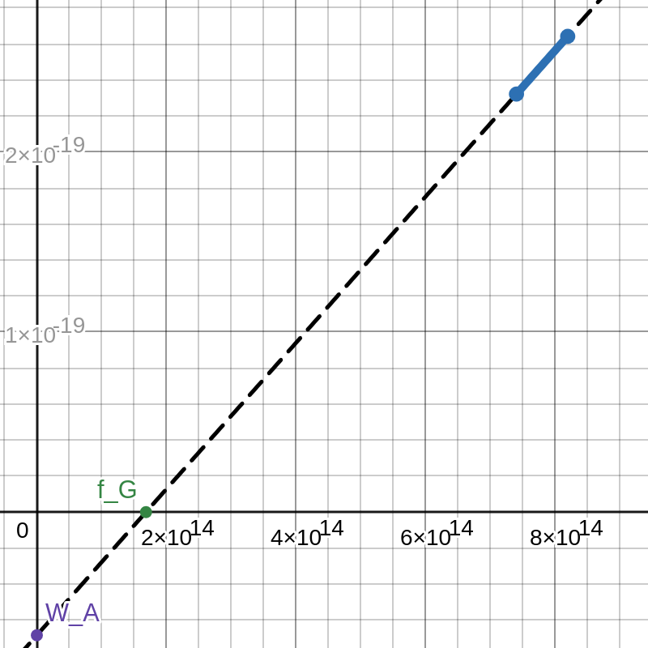

# Quantenphysik
---

### Hallwachs-Effekt

#### Versuchsaufbau
* Silberdampflampe
* Elektroskop mit Zinkblech

#### Beobachtung
* Elektronen werden von der Metalloberfläche durch das Licht herausgelöst

### Einstein-Gerade

$$
\begin{align*}
f_G ~&\dots~ \text{Grenzfrequenz} \\
W_A ~&\dots~ \text{Arbeitsaufwand} \\
E_\text{kin}(f) &= h\cdot f - W_A \\
E_\text{kin}(f_G) &= 0 \\
\end{align*}
$$

### Zwischenfazit

Die Energie von elektromagnetischer Strahlung wird in Energieportionen übertragen, welche über $h \cdot f$ bestimmt werden kann. Ist dies eine Begründung, dass Licht aus Teilchen besteht?

**Licht ist weder Welle noch Teilchen.**

Wir sprechen besser von *Quantenobjekten* (im Fall von Licht heißen diese *Photonen*). Diesem Quantenobjekt lassen sich physikalische Größen zuordnen, die wir allgemein nur bei einer Welle oder bei einem Teilchen kennen, z.B.:
* Ort
* Impuls
* Masse
* Energie
* Frequenz
* Wellenlänge
* Polarisation

### Der Compton-Effekt
Wenn man Licht auf ein freies Elektron schießt, verhalten sich das Photon und das Elektron wie bei einem elastischen Stoß.

$$
\begin{align*}
E &= mc^2 \\
&= hf \\
\rightarrow m &= \frac{hf}{c^2} \\
&= \frac{h}{c\lambda} \\
p &= m \cdot v \\
&= m \cdot c \\
\rightarrow p &= \frac{h}{\lambda}
\end{align*}
$$

> Annahmen:
> * Schiff absorbiert alles Licht
> 
> $$
> \begin{align*}
> n &\dots \text{Anzahl Photonen in }\frac1{\text{s}} \\
> p_2 &= \frac{h}{\lambda} \\
> &= m_2v_2 \\
> u_1 &= \frac{(m_1-m_2)v_1 + 2p_2}{m_1 + m_2} \\
> &= \frac{(m_1-\frac{h}{c\lambda})v_1 + 2p_2}{m_1 + \frac{h}{c\lambda}} \\
> &= \frac{p_1 - \frac{h}{c\lambda}v_1 + 2p_2}{m_1 + \frac{h}{c\lambda}} \\
> \Delta v &= v_1 - u_1 \\
> &= p_1\left( \frac{1}{m_1} - \frac{1}{m_1 + \frac{h}{c\lambda}} \right) + \frac{2p_1 - \frac{h}{c\lambda}v_1}{m_1 + \frac{h}{c\lambda}} \\
> a &= \frac{\Delta v}{t} \\
> &= \Delta v \cdot n \\
> F &= m_1 \cdot \Delta v \cdot n \\
> &= m_1 \cdot \left( p_1\left( \frac{1}{m_1} - \frac{1}{m_1 + \frac{h}{c\lambda}} \right) + \frac{2p_2 - \frac{h}{c\lambda}v_1}{m_1 + \frac{h}{c\lambda}} \right) \cdot n \\
> &= G \cdot \frac{m_1 \cdot m_s}{d^2} \\
> \end{align*}
> $$
> 
> $$ \Rightarrow d = \frac{\sqrt{18931629} \sqrt{\displaystyle \frac{G m_{1} m_{s} \left(8565498,8\cdot10^{42} \lambda m_{1} + 18931629\right)}{n \left(- m_{1} v_{1} + 599584916 m_{1} + m_1v_1\right)}}}{18931629} $$

### Elektronen als Quantenobjekt
Louis de Broglie sagte, dass Elektronen Quantenobjekte sind, denen man eine Wellenlänge $\lambda$ zuordnen kann. Je nach Versuchsanordnung lassen sich Wellen- oder Teilcheneigenschaften nachweisen.

**De-Broglie-Wellenlänge für alle massebehafteten Teilchen:**
$$ \lambda = \frac{h}{m \cdot v} $$

