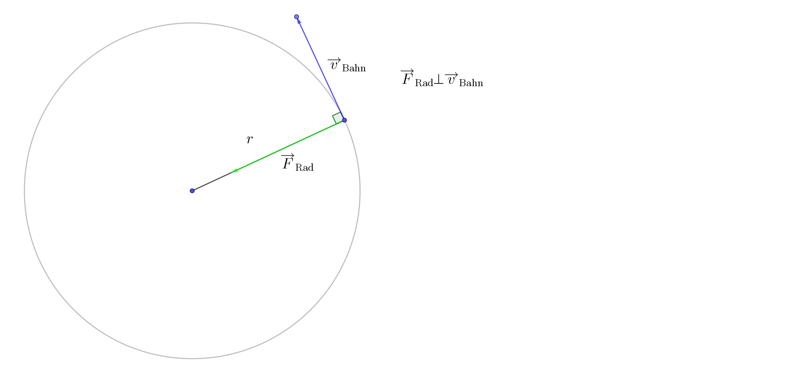

# Kräfte
---


Die Kraft gibt an, wie stark zwei Körper miteinander wechselwirken.

**Formelzeichen**: $F$
**Einheit**: $\displaystyle [F] = 1\text{ N} = 1 \frac{\text{kg} \cdot \text m}{\text s^2} $

# Newtonsche Grundgesetze

## 1. Axiom - Trägheitsgesetz
Ein Körper bleibt in Ruhe oder in geradlinig gleichförmiger Bewegung, solange die Summe der auf ihn wirkenden Kräfte null ist.

## 2. Axiom - Grundgesetz
$$ \overrightarrow F = m \cdot \overrightarrow a $$
Ein Körper beschleunigt in die Richtung der resultierenden Kraft.
$$ \overrightarrow F = \frac{d\overrightarrow p}{dt} $$
Kräfte bewirken eine Änderung des Bewegungszustandes (Impuls).

## 3. Axiom - Wechselwirkungsgesetz
Wirken zwei Körper aufeinander ein, so wirkt auf jeden Körper eine Kraft. Diese Kräfte sind gleich groß und entgegengesetzt gerichtet.
$$ \overrightarrow F_1 = -\overrightarrow F_2 $$

## Bemerkungen und Folgerungen der Axiome
1. Das Trägheitsgesetz ist nur ein Spezialfall des Newtonschen Grundgesetzes
2. Inertialsysteme (Bezugssystem, in denen das Trägheitsgesetz gilt) \
    In Nicht-Intertialsystemen treten "Scheinkräfte" auf. Diese treten nur auf, weil das Bezugssystem beschleunigt wird.

    Bsp.: Bremsen & Anfahren beim Auto, Corioliskraft, Fliehkraft
3. 
4. 
5. Alle Massen fallen mit der gleichen Beschleunigung

# Reibung

## Reibungskraft

$$ F_R = \mu \cdot F_N ~~~~~~~~~ \begin{array}{rcl}
\mu &-& \text{Reibungszahl (meist zw. 0 und 1)} \\
F_N &-& \text{Normalkraft (Normale zu Oberfläche)}
\end{array} $$

`Kraftumformende Einrichtung: Geneigte Ebene einfügen`

$$
\begin{align*}
F_N &= F_G\cos\alpha = mg\cos\alpha \\
F_H &= F_G\sin\alpha = mg\sin\alpha
\end{align*}
$$

### Arten der Reibung

$\mu_H$|$\mu_G$|$\mu_R$
-|-|-
**Haftreibung** liegt vor, wenn ein Körper auf einem anderen haftet, die Körper also relativ zueinander in Ruge sind.|**Gleitreigung** liegt vor, wenn ein Körper auf einem anderen glietet, die Körper also relativ zueinander in Bewegung sind.|**Rollreibung** liegt vor, wenn ein Körper auf einem anderen abrollt.
Bei einem mit angezogener Bremse stehenden Auto tritt Haftreibung zwischen Bremse & Rad sowie zwischen Reifan & Straße auf.|Bei einer Person, die sich eine Rutsche hinunterbewegt, tritt Gleitreibung auf.|Bei einem Radfahrer tritt Rollreibung auf.

$$ \mu_H>\mu_G>\mu_R $$

## Luftreibung

```vega-lite
{
  "data": {
    "values": [
        {"t": "0", "v": "0"},
        {"t": "10", "v": "8"},
        {"t": "20", "v": "14"},
        {"t": "30", "v": "18"},
        {"t": "40", "v": "20"},
        {"t": "50", "v": "20"},
        {"t": "51", "v": "16"},
        {"t": "53", "v": "12"},
        {"t": "57", "v": "9"},
        {"t": "60", "v": "7.5"},
        {"t": "70", "v": "6"},
        {"t": "100", "v": "6"}
    ]
  },
  "mark": "line",
  "encoding": {
    "x": {"field": "t", "type": "quantitative"},
    "y": {"field": "v", "type": "quantitative", "scale": {"domain": [0, 30]}}
  }
}
```

$$
\begin{align*}
F_R &= \frac12c_w\cdot \rho \cdot A \cdot v^2
\\~\\
c_w &-~\text{Luftreibungskoeffizient / Widerstandsbeiwert} \\
\rho &-~\text{Dichte des Mediums} \\
A &-~\text{Querschnittsfläche} \\
v &-~\text{Geschwindigkeit}
\end{align*}
$$

#### Experiment: Welchen $c_w$-Wert besitz ein Fallkegel?

$$
\begin{align*}
d &= 15 \text{ cm} \\
\varrho_L &= 1,29 \frac{\text{kg}}{\text m^3} \\
s &= 3,40 \text{ m} \\
t &= 3,06 \text{ s} \\
v &= \frac st \\
m &= 1,7 \text{ g} \\
\end{align*}
$$

$$
\begin{align*}
F_R &= F_G \\
\frac12c_w\rho Av^2 &= m \cdot g \\
A &= \frac14\pi d^2 \\
\rho &= \varrho_L \\
\frac12c_w\varrho_L\frac14\pi d^2 \frac{s^2}{t^2} &= m\cdot g \\
\rightarrow c_w &= \frac{8mgt^2}{\varrho_L\pi d^2s^2} \\
&\approx 1,19
\end{align*}
$$

## Reibungsarbeit

Reibung führt zur Entwertung mechanischer Energie. Der Energieerhaltungssatz der Mechanik ist nicht mehr erfüllt, wohl aber der allgemeine Energieerhaltungssatz.

Reibungsarbeit "entnimmt" dem mechanischen System Energie.
(Vorzeichen der Arbeit bleibt unberücksichtigt)
$$ W_\text{Reib} = \Delta E ~~~~~~\text{bzw.}~~~~~~ W_\text{Reib} = E_\text{Anfang} - E_\text{Ende} $$

Reibung → Thermische Energie des Körpers und der Umgebung

Wie berechnet sich die Reibungsarbeit?

$$
\begin{align*}
W_R &= \Delta E \\
W_R &= F_R \cdot s
\end{align*}
$$

# Kräfteaddition

Die Seilkräfte kompensieren gemeinsam die Gewichtskraft.

$$
\begin{align*}
\overrightarrow F_G &= \left(\begin{matrix}0 \text{ N}\\5 \text{ N} \end{matrix}\right)\\
\overrightarrow F_{\text{Seil}} &= \left(\begin{matrix}x\\|\overrightarrow F_G|\over2\end{matrix}\right) \\
\alpha &= 90 \degree - 75 \degree = 15\degree \\
b &= \frac{|\overrightarrow F_G|}{2} \\
&= 2,5 \text{ N} \\
\sin \alpha &= \frac bc \\
\rightarrow c &= \frac{b}{\sin\alpha} \\
&=  |\overrightarrow F_\text{Seil}| \\
\rightarrow |\overrightarrow F_\text{Seil}| &= \frac{2,5 \text{ N}}{\sin(15\degree)} \\
&\approx 9,7 \text{ N} \\
|\overrightarrow F_\text{Seil}|^2 &= x_{F\text{Seil}}^2 + y_{F\text{Seil}}^2 \\
\rightarrow x &= \sqrt{ |\overrightarrow F_\text{Seil}|^2 - y_{F\text{Seil}}^2 } \\
&\approx \sqrt{9,7^2 - 2,5^2} \text{ N} \\
\approx 9,4 \text{ N} \\
\Rightarrow \overrightarrow F_\text{Seil} &\approx \left(\begin{matrix}9,4 \text{ N}\\2,5 \text{ N}\end{matrix}\right)
\end{align*}
$$

## Atwood'sche Fallmaschine

@import "Bilder/Atwood'sche Fallmaschine.svg"

$$
\begin{align*}
\overrightarrow F_1 - \overrightarrow F_2 &= (m_1+m_2) \cdot a \\
m_1g - m_2g &= (m_1+m_2) \cdot a
\end{align*}
$$

$ 19,80909 \frac{\text m}{\text s} $

# Gleichförmige Kreisbewegung

Die gleichförmige Kreisbewegung ist eine **beschleunigte Bewegung:**
$$ |\overrightarrow v| = \text{konstant} ~~~~~~\textbf{ aber }~~~~~~ \overrightarrow v \neq \text{konstant} $$



$$
\begin{align*}
v_B &= \frac st = \frac uT \\
&= \frac{2\pi r}T = 2\pi rf
\end{align*}
~~ ~~~~~~
\begin{matrix}
T &-& \text{Periodendauer} \\
f &-& \text{Drehzahl}
\end{matrix}
$$

**Allgemein gilt:**
$$
\begin{align*}
v_B &= \frac{2\pi r}T \\
T &= \frac1f
\end{align*}
$$

## Winkelgeschwindigkeit $\omega$

**Formelzeichen**: $\omega$
**Einheit**: $\displaystyle [\omega] = 1 \frac{1}{\text s} = 1\text{ Hz} $

Die Winkelgeschwindigkeit gibt die Winkeländerung pro Zeit an:
$$ \omega = \frac{d\alpha}{dt} $$

$$
\begin{align*}
\omega &= \frac{2\pi}{T} \\
&= 2\pi f
\end{align*}
$$

|$$ \begin{align*} v_B &= \omega \cdot r \\ \omega &= \frac{v_b}{r} \end{align*} $$|
|-|

## Radialkraft / Zentripetalkraft

Die Kreisbewegung ist eine geschleunigte Bewegung. Es muss also eine Kraft wirken, die den Körper auf eine radiale Bahn zwingt: die **Zentripetalkraft** oder **Radialkraft**.

$$ \overrightarrow F_r \perp \overrightarrow v_B $$
$$ F_r = \frac{mv^2}{r} = mr\omega^2 $$

> #### WICHTIG
> Die Zentrifugalkraft ist eine **Scheinkraft**!