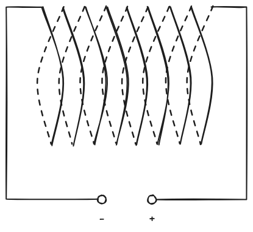

# Magnetisches Feld
---

> ### Geschichtliches
> Bereits in der Antike gab es Kenntnis von der Existenz besonderer Magnetsteine (Magnetit). Diese konnten Eisen anziehen. Magnetite sind heute in Mineraliengeschäften erhältlich und eine kristalline Verbindung zwischen Eisen und Sauerstoff. Dies ist aber der Ursprung des Namen "Magnet".

## Magnetisieren und Entmagnetisieren
Ferromagnetische Stoffe besitzen Elementarmagnete ("Weiß'sche Bezirke"), die in einem unmagnetisierten ferromagnetischen Stoff ungeordnet sind. Dadurch entsteht keine Vorzugsrichtung der Magnetpole. Durch ein äußeres Magnetfeld richten sich diese Elementarmagnete aus. Dadurch entsteht eine Vorzugsrichtung der Pole und es kommt zur messbaren Ausprägung von Kräften.

Zum Entmagnetisieren kann man den Körper erschüttern oder auf die jeweilige Curie-Temperatur erhitzen.

> **Wichtig**: Das ist nur ein Modell zum einfacheren Verständnis!

# Magnetfeld

Ein magnetisches Feld ist der Zustand des Raumes um einen Magneten, in dem auf andere elektrisch Magnete bzw. Körper aus ferromagnetischen Stoffen Kräfte ausgeübt werden.

**Eigenschaften der Feldlinien:**
* Feldlinien verlaufen immer von Nord- zu Südpol
* die Feldstärke ist umso größer, je dichter die Linien verlaufen
* Feldlinien sind in sich geschlossen

*Elektrische Felder sind wirbelfreie Quellenfelder, Magnetfelder sind quellenfreie Wirbelfelder*

### Typische Feldlinienbilder
Siehe LB. S. 299, 300

> #### Linke-Hand-Regel
> Mit dem linken Daumen in die Elektronenflussrichtung zeigen, dann zeigen die gekrümmten Finger in die Richtung des Magnetfeldes eines geraden Leiters.

## Die magnetische Flussdichte
Kraft auf einen Stromdurchflossenen Leiter:
$$ \overrightarrow{ F } = I \cdot l \cdot \overrightarrow{ B } $$
Somit gilt für die magnetische Flussdichte:
$$ \overrightarrow{ B } = \frac{ \overrightarrow{ F } }{I \cdot l} $$
$\displaystyle \overrightarrow{ B } $ ist eine vektorielle Größe. Sie zeigt in Richtung der Feldlinien.

**Einheit:** $\displaystyle [ \overrightarrow{ B } ] = \text{T} = \frac{\text N}{\text{Am}} = \frac{\text{Vs}}{\text m^2} = \frac{\text{kg}}{\text{As}^2} $

### Flussdichte einer Spule
> Hierbei wird eine lange, schlanke Spule betrachtet, dessen Länge $l$ deutlich größer als der Durchmesser $d$ ist: $l \gg d$

Im Inneren ist das Feld (annähernd) homogen, Randeffekte sind messbar.

|$$\begin{align*}B &= \mu_0 \cdot \mu_r \cdot \frac{N\cdot I}{l}\end{align*} ~~~~~~~~~~~~~~~~\begin{align*}N&\in\mathbb N \\ [I]&= \text A \\\mu_0~&\dots~ \text{magnetische Feldkonstante} \\&\,\approx\,~ 1,256637\cdot 10^{-6} \frac{\text{Vs}}{\text{Am}} \\&\,=\,~ 4\pi\cdot 10^{-7} \frac{\text{Vs}}{\text{Am}} \\\mu_r~&\dots~ \text{Permeabilitätszahl}\end{align*}$$|
|-|